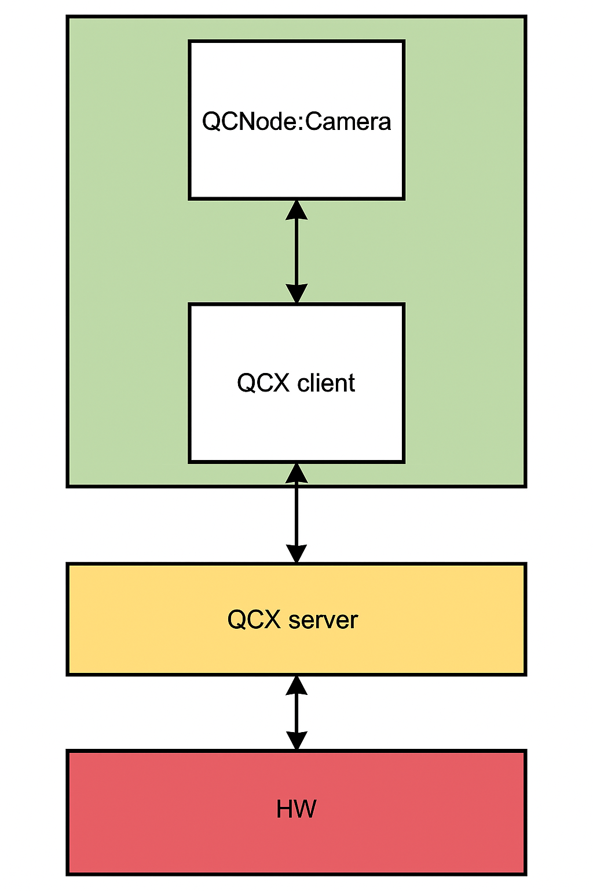
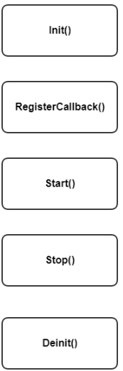

*Menu*:
- [1. Introduction](#1-introduction)
  - [1.1 Functional overview](#11-functional-overview)
  - [1.2 Operational overview](#12-operational-overview)
- [2. Camera Configuraion](#2-camera-configuraion)
  - [2.1 Camera Node Configuraion](#21-camera-node-configuraion)
  - [2.2 Camera Stream Configuraion](#22-camera-stream-configuraion)
- [3. Camera APIs](#3-camera-apis)
  - [3.1 QCNode Voxelization APIS](#31-qcnode-voxelization-apis)
  - [3.2 QCNode Configuration Interfaces](#32-qcnode-configuration-interfaces)
- [4. Camera Examples](#4-camera-examples)
  - [4.1 Camera working mode](#41-camera-working-mode)
    - [4.1.1 Request buffer mode](#411-request-buffer-mode)
    - [4.1.2 Non request buffer mode](#412-non-request-buffer-mode)
  - [4.2 header files and macro/variable definitions](#42-header-files-and-macrovariable-definitions)
  - [4.3 callback function definition](#43-callback-function-definition)
  - [4.4 Camera Config initialization](#44-camera-config-initialization)
  - [4.5 Camera stream configuration and buffer allocation](#45-camera-stream-configuration-and-buffer-allocation)
  - [4.6 Camera execution](#46-camera-execution)
  - [4.7 Buffer free](#47-buffer-free)
  - [4.8 Main function](#48-main-function)
- [5. References](#5-references)


# 1. Introduction
This document describes the QCNode Camera APIs and provides code samples demonstrating their usage.

## 1.1 Functional overview
QCNode Camera is a wrapper around QCarCam that offers user-friendly APIs for seamless camera integration in ADAS (Advanced Driver Assistance Systems) applications.

Camera SW arch


## 1.2 Operational overview
A camera instance is operated through a sequence of function calls for optimal performance, as outlined below:

- Initialization
  - Call Init() to configure parameters and create a camera session.
- Register Callbacks
  - Use RegisterCallback() to set up event callbacks for handling frame and driver events.
- Start Streaming
  - Invoke Start() to activate the camera hardware and begin processing sensor signals. When a new frame is captured, the frame-done callback is triggered. After processing the frame, the application must return it to the camera.



# 2. Camera Configuraion

## 2.1 Camera Node Configuraion
| Parameter    | Required  | Type        | Description            |
|--------------|-----------|-------------|------------------------|
| `name`       | true      | string      | The Node unique name.  |
| `id`         | true      | uint32_t    | The Node unique ID.    |
| `inputId`    | true      | uint32_t    | Camera input id.       |
| `srcId`      | true      | uint32_t    | Camera Input source identifier.       |
| `clientId`   | true      | uint32_t    | Used for multi-client use case.       |
| `inputMode`  | true      | uint32_t    | The input mode id is the index into #QCarCamInputModes_t pModex.       |
| `ispUseCase` | true      | uint32_t    | ISP use case defined by qcarcam.       |
| `opMode`     | true      | uint32_t    | Operation mode defined by qcarcam.     |
| `camFrameDropPattern` | true      | uint32_t    | Frame drop pattern defined by qcarcam. Default: `0`   |
| `camFrameDropPeriod`  | true      | uint32_t    | Frame drop period defined by qcarcam. Default: `0`   |
| `streamConfigs`       | true      | object[]    | Configurations for each camera stream. The stream object configuration is shown in Camera Stream Configuraion table. |
| `requestMode`| false     | bool         | Flag to set request buffer mode.   |
| `primary`    | false     | bool         | Flag to indicate if the session is primary or not when configured with the clientId.   |
| `recovery`   | false     | bool         | Flag to enable self-recovery for the session.   |

## 2.2 Camera Stream Configuraion
| Parameter    | Required  | Type         | Description                  |
|--------------|-----------|--------------|------------------------------|
| `streamId`   | true      | uint32_t     | Camera stream id.            |
| `bufCnt`     | true      | uint32_t     | Buffer count set to camera.  |
| `width`      | true      | uint32_t     | Camera frame width.          |
| `height`     | true      | uint32_t     | Camera frame height.         |
| `format`     | true      | string       | Camera frame format. Options: `nv12`, `nv12_ubwc`, `uyvy`, `rgb`, `bgr`, `p010`, `tp10_ubwc` |
| `submitRequestPattern`   | true         | uint32_t    | Buffer submit request pattern.   |

- Example Configurations
```json
{
    "static": {
        "name": "CAM0",
        "id": 0,
        "inputId": 8,
        "srcId": 0,
        "clientId": 0,
        "inputMode": 0,
        "ispUseCase": 65,
        "camFrameDropPattern": 0,
        "camFrameDropPeriod": 0,
        "opMode": 2,
        "streamConfigs": [
            {
                "streamId": 1,
                "bufCnt": 8,
                "format": "nv12",
                "height": 2160,
                "width": 3840,
                "submitRequestPattern": 0
            }
        ],
        "requestMode": true,
        "primary": false,
        "recovery": false
    }
}
```

# 3. Camera APIs

## 3.1 QCNode Voxelization APIS

- [Camera::Initialize](../include/QC/Node/Camera.hpp#L226)
- [Camera::Start](../include/QC/Node/Camera.hpp#L244)
- [Camera::ProcessFrameDescriptor](../include/QC/Node/Camera.hpp#L257)
- [Camera::Stop](../include/QC/Node/Camera.hpp#L263)
- [Camera::DeInitialize](../include/QC/Node/Camera.hpp#L269)
- [Camera::GetConfigurationIfs](../include/QC/Node/Camera.hpp#L232)
- [Camera::GetMonitoringIfs](../include/QC/Node/Camera.hpp#L238)

## 3.2 QCNode Configuration Interfaces

- [CameraConfig::GetOptions](../include/QC/Node/Camera.hpp#L110) Get Configuration Options
  - Use this API to get the configuration options.
    - Below was a example output for Camera request mode:
        ```json
        {
            "static": {
                "name": "CAM0",
                "id": 0,
                "inputId": 8,
                "srcId": 0,
                "clientId": 0,
                "inputMode": 0,
                "ispUseCase": 65,
                "camFrameDropPattern": 0,
                "camFrameDropPeriod": 0,
                "opMode": 2,
                "streamConfigs": [
                    {
                        "streamId": 1,
                        "bufCnt": 8,
                        "format": "nv12",
                        "height": 2160,
                        "width": 3840,
                        "submitRequestPattern": 0
                    }
                ],
                "requestMode": true,
                "primary": false,
                "recovery": false
            }
        }
        ```

# 4. Camera Examples

## 4.1 Camera working mode

### 4.1.1 Request buffer mode
Camera works on request buffer mode when `requestMode` parameter is set to true in camera config. In this mode new camera frames are delivered in frame callback function and user can request new frames from camera when processing of the frame is done in application.

### 4.1.2 Non request buffer mode
Camera works on non request buffer mode when `requestMode` parameter is set to false in camera config. In this mode new camera frames are delivered in frame callback function and user shall release the frame back to camera when processing of the frame is done in application.


## 4.2 header files and macro/variable definitions
```c++
#include <chrono>
#include <fstream>
#include <iostream>
#include <string>

#include "QC/Node/Camera.hpp"
#include "QC/sample/SharedBufferPool.hpp"
#include "gtest/gtest.h"

using namespace QC;
using namespace QC::Node;
using namespace QC::sample;

std::string g_CameraConfig = EXPAND_JSON( {
            "static": {
                "name": "CAM0",
                "id": 0,
                "inputId": 8,
                "srcId": 0,
                "clientId": 0,
                "inputMode": 0,
                "ispUseCase": 65,
                "camFrameDropPattern": 0,
                "camFrameDropPeriod": 0,
                "opMode": 2,
                "streamConfigs": [
                    {
                        "streamId": 1,
                        "bufCnt": 8,
                        "format": "nv12",
                        "height": 2160,
                        "width": 3840,
                        "submitRequestPattern": 0
                    }
                ],
                "requestMode": true,
                "primary": false,
                "recovery": false
            }
        } );

QC::Node::Camera g_camera;
uint32_t g_frameIdx = 0;
std::vector<SharedBufferPool> g_bufferPools;
```

## 4.3 callback function definition
```c++
void ProcessDoneCb( const QCNodeEventInfo_t &eventInfo )
{
    QCStatus_e ret = QC_STATUS_OK;

    QCFrameDescriptorNodeIfs &frameDescIfs = eventInfo.frameDesc;
    QCBufferDescriptorBase_t &bufDesc = frameDescIfs.GetBuffer( 0 );
    QCSharedFrameDescriptorNode frameDesc( 1 );

    const CameraFrameDescriptor_t *pCamFrameDesc =
            dynamic_cast<const CameraFrameDescriptor_t *>( &bufDesc );

    if ( QC_STATUS_OK == ret )
    {
        CameraFrameDescriptor_t camFrameDesc = *pCamFrameDesc;
        ret = frameDesc.SetBuffer( 0, camFrameDesc );
        ret = g_camera.ProcessFrameDescriptor( frameDesc );
        std::cout << "Process Frame index: " << g_frameIdx << std::endl;
        g_frameIdx++;
    }
}
```

## 4.4 Camera Config initialization
```c++
void Init_CameraConfig( std::string &jsonStr )
{
    QCStatus_e ret;
    DataTree dt;
    DataTree staticCfg;
    QCNodeInit_t config;

    ret = dt.Load( jsonStr, errors );
    std::cout << "config: " << config.config << std::endl;

    config.callback = ProcessDoneCb;

    ret = dt.Get( "static", staticCfg );
    std::string name = staticCfg.Get<std::string>( "name", "" );
    QCNodeID_t nodeId;
    nodeId.name = name;
    nodeId.type = QC_NODE_TYPE_QCX;
    nodeId.id = staticCfg.Get<uint32_t>( "id", UINT32_MAX );
}
```

## 4.5 Camera stream configuration and buffer allocation
```c++
void Init_CameraStreams()
{
    QCStatus_e ret;
    std::vector<DataTree> streamConfigs;
    ret = staticCfg.Get( "streamConfigs", streamConfigs );

    DataTree streamConfig;
    QCImageProps_t imgProp;
    uint32_t streamId = 0;
    uint32_t bufCnt = 0;
    uint32_t bufferId = 0;
    uint32_t numStream = streamConfigs.size();
    g_bufferPools.resize( numStream );

    for ( uint32_t i = 0; i < numStream; i++ )
    {
        std::string bufPoolName = name + std::to_string( i );
        streamConfig = streamConfigs[i];
        streamId = streamConfig.Get<uint32_t>( "streamId", UINT32_MAX );
        bufCnt = streamConfig.Get<uint32_t>( "bufCnt", UINT32_MAX );
        imgProp.format = streamConfig.GetImageFormat( "format", QC_IMAGE_FORMAT_MAX );
        imgProp.width = streamConfig.Get<uint32_t>( "width", UINT32_MAX );
        imgProp.height = streamConfig.Get<uint32_t>( "height", UINT32_MAX );

        if ( ( QC_IMAGE_FORMAT_RGB888 == imgProp.format ) ||
             ( QC_IMAGE_FORMAT_BGR888 == imgProp.format ) )
        {
            imgProp.batchSize = 1;
            imgProp.stride[0] = QC_ALIGN_SIZE( imgProp.width * 3, 16 );
            imgProp.actualHeight[0] = imgProp.height;
            imgProp.numPlanes = 1;
            imgProp.planeBufSize[0] = 0;

            ret = g_bufferPools[i].Init( bufPoolName, nodeId, LOGGER_LEVEL_ERROR, bufCnt, imgProp,
                                         QC_MEMORY_ALLOCATOR_DMA_CAMERA, QC_CACHEABLE );
        }
        else
        {
            ret = g_bufferPools[i].Init( bufPoolName, nodeId, LOGGER_LEVEL_ERROR, bufCnt,
                                         imgProp.width, imgProp.height, imgProp.format,
                                         QC_MEMORY_ALLOCATOR_DMA_CAMERA, QC_CACHEABLE );
        }

        ret = g_bufferPools[i].GetBuffers( config.buffers );
    }
}
```

## 4.6 Camera execution
```c++
ret = g_camera.Initialize( config );
ret = g_camera.Start();

while (...)
{
    // Waiting loop to get camera frames
}

ret = g_camera.Stop();
ret = g_camera.DeInitialize();
```

## 4.7 Buffer free
```c++
for ( uint32_t i = 0; i < numStream; i++ )
{
    ret = g_bufferPools[i].Deinit();
}
```

## 4.8 Main function
```c++
int main()
{
    QCStatus_e ret;
    Init_CameraConfig( g_CameraConfig );
    Init_CameraStreams();

    ret = g_camera.Initialize( config );
    ret = g_camera.Start();

    while (...)
    {
        // Waiting loop to get camera frames
    }

    ret = g_camera.Stop();
    ret = g_camera.DeInitialize();

    for ( uint32_t i = 0; i < numStream; i++ )
    {
        ret = g_bufferPools[i].Deinit();
    }

    return 0;
}
```

# 5. References
- [gtest Camera](../tests/unit_test/Node/Camera/gtest_NodeCamera.cpp).
- [Sample Camera](../tests/sample/source/SampleCamera.cpp).