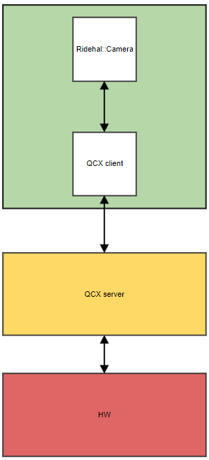

*Menu*:
- [1. Introduction](#1-Introduction)
  - [1.1 Functional overview](#11-Functional-overview)
  - [1.2 Operational overview](#12-Operational-overview)
- [2. Data structures](#2-Data-structures)
  - [2.1 Type definitions](#21-Type-definitions)
    - [2.1.1 Camera frame structure](#211-Camera-frame-structure)
    - [2.1.2 Camera input structure](#212-Camera-input-structure)
    - [2.1.3 Camera configuratione](#213-Camera-configuration)
    - [2.1.4 Callback function for frame done](#214-Callback-function-for-frame-done)
    - [2.1.5 Callback function for camera event](#215-Callback-function-for-camera-event)
  - [2.2 APIs](#22-APIs)
- [3. Typical use case and sample codes](#3-Typical-use-case-and-sample-codes)
  - [3.1 Non request buffer mode](#31-Non-request-buffer-mode)
  - [3.2 Request buffer mode](#32-Request-buffer-mode)
  - [3.3 Set external allocated buffers to Camera](#33-Set-external-allocated-buffers-to-Camera)
  - [3.4 qcarcam multi-client feature](#34-qcarcam-multi-client-feature)
  - [3.5 Submit Request Pattern for multiple streaming of the camera](#35-submit-request-pattern-for-multiple-streaming-of-the-camera)
  - [3.6 Camera frame drop pattern and period](#36-camera-frame-drop-pattern-and-period)
- [4. References](#4-references)


# 1. Introduction
This document describes Ridehal Camera APIs, and it provides the corresponding code samples that show how to use them.

## 1.1 Functional overview
Ridehal Camera is a Ridehal component. It's a warpper of Qcarcam which provides user friendly APIs for easy integration of camera on ADAS use case. 



## 1.2 Operational overview
A Camera instance can be operated via a sequence of function calls for optimal execution as described below:

At the very beginning, Init() is called to configure the parameters and create a camera session. Then we shall call RegisterCallback() to register a event callback which handles the frame callback and event callback from camera driver. Now we can call Start() to trigger the start of the camera hardware to process signals from sensors. Frame done callback shall be triggered once a new frame is received from camera. Application shall return the frame back to camera once the processing is done. Stop() can be called to
stop the streaming at any time when camera is running. At the end we need to call Deinit() to destroy the camera session.     


# 2. Data structures
## 2.1 Type definitions
### 2.1.1 Camera frame structure

- [CameraFrame_t](../include/ridehal/component/Camera.hpp#L33)

```c
/** @brief Camera frame structure */
typedef struct
{
    RideHal_SharedBuffer_t sharedBuffer; /**< Shared buffer associated with the image */
    uint64_t timestamp;                  /**< Hardware timestamp (in nanoseconds) */
    uint64_t timestampQGPTP; /**< Generic Precision Time Protocol (GPTP) timestamp in nanoseconds */
    uint32_t frameIndex;     /**< Index of the camera frame */
    uint32_t flags;          /**< Flag to indicate error state of the buffer */
    uint32_t streamId;       /**< Qcarcam buffer list id */
} CameraFrame_t;
```

### 2.1.2 Camera input structure

- [CameraInputs_t](../include/ridehal/component/Camera.hpp#L42)

```c
/** @brief Camera input structure */
typedef struct
{
    QCarCamInput_t *pCameraInputs; /**< pointer to the list of qcarcam inputs info */
    QCarCamInputModes_t
            *pCamInputModes; /**< pointer to the list of qcarcam input modes for each input */
    uint32_t numInputs;      /**< num of qcarcam inputs */
} CameraInputs_t;
```

### 2.1.3 Camera configuration

- [CameraStreamConfig_t](../include/ridehal/component/Camera.hpp#L60)

```c
/** @brief Camera stream config */
typedef struct
{
    uint32_t streamId;             /**< Camera stream id */
    uint32_t width;                /**< Frame width */
    uint32_t height;               /**< Frame height */
    uint32_t bufCnt;               /**< Buffer count set to camera */
    uint32_t submitRequestPattern; /**< Buffer submit request pattern */
    RideHal_ImageFormat_e format;  /**< Camera frame format */
} CameraStreamConfig_t;
```

- [Camera_Config_t](../include/ridehal/component/Camera.hpp#L80)

```c
typedef struct Camera_Config
{
    uint32_t numStream; /**< Number of camera stream */
    uint32_t inputId;   /**< Camera input id */
    uint32_t srcId;     /**< Input source identifier. See #QCarCamInputSrc_t */
    uint32_t clientId; /**< client id, used for multi client usecase, set to 0 by default for single
                         client usecase */
    uint32_t inputMode;       /**< The input mode id is the index into #QCarCamInputModes_t pModex*/
    uint32_t ispUserCase;     /**< ISP user case defined by qcarcam */
    uint32_t camFrameDropPattern; /**< Frame drop patten defined by qcarcam. Set to 0 when frame
                                 drop is not used */
    uint32_t camFrameDropPeriod;  /**< Frame drop period defined by qcarcam. */
    uint32_t opMode;          /**< Operation mode defined by qcarcam */
    CameraStreamConfig_t streamConfig[MAX_CAMERA_STREAM]; /**< Per stream configuration */
    bool bAllocator;   /**< Flag to indicate if component is buffer allocator*/
    bool bRequestMode; /**< Flag to set request buffer mode */
    bool bPrimary;     /**< Flag to indicate if the session is primary or not when configured the
                          clientId */
} Camera_Config_t;
```

### 2.1.4 Callback function for frame done

```c
typedef void ( *RideHal_CamFrameCallback_t )( CameraFrame_t *pFrame, void *pPrivData );
```

### 2.1.5 Callback function for camera event

```c
typedef void ( *RideHal_CamEventCallback_t )( const uint32_t eventId, const void *pPayload, void *pPrivData );
```
## 2.2 APIs

- [GetInputsInfo](../include/ridehal/component/Camera.hpp#L104)
```c
    /**
     * @brief get camera inputs info
     *
     * @param[out] pCamInputs Input info queried from Camera
     *
     * @return RIDEHAL_ERROR_NONE on success, others on failure
     */
    RideHalError_e GetInputsInfo( CameraInputs_t *pCamInputs );
```

- [Init](../include/ridehal/component/Camera.hpp#L115)
```c
    /**
     * @brief init the Camera object
     *
     * @param[in] pName   Name of the component
     * @param[in] pConfig Camera configurations
     * @param[in] level   Logging level
     *
     * @return RIDEHAL_ERROR_NONE on success, others on failure
     */
    RideHalError_e Init( char *pName, const Camera_Config_t *pConfig,
                         Logger_Level_e level = LOGGER_LEVEL_ERROR );
```

- [SetBuffers](../include/ridehal/component/Camera.hpp#L127)
```c
    /**
     * @brief set a list of shared buffers to camera
     *
     * @param[in] pBuffer Pointer to the buffer list
     * @param[in] numBuffers Number of buffers in the list
     * @param[in] streamId Buffer list id
     *
     * @return RIDEHAL_ERROR_NONE on success, others on failure
     */
    RideHalError_e SetBuffers( const RideHal_SharedBuffer_t *pBuffer, uint32_t numBuffers,
                               uint32_t streamId );
```

- [GetBuffers](../include/ridehal/component/Camera.hpp#L140)
```c
    /**
     * @brief get a list of shared buffers use by the camera
     *
     * @param[in] pBuffers Pointer to the buffer list
     * @param[in] numBuffers Number of buffers in the list
     * @param[in] streamId Buffer list id
     *
     * @return RIDEHAL_ERROR_NONE on success, others on failure
     */
    RideHalError_e GetBuffers( RideHal_SharedBuffer_t *pBuffers, uint32_t numBuffers,
                               uint32_t streamId );
```

- [RegisterCallback](../include/ridehal/component/Camera.hpp#L152)
```c
    /**
     * @brief register callbacks to camera
     *
     * @param[in] frameCallback Frame callback function
     * @param[in] eventCallback Event callback function
     * @param[in] pAppPriv App private data
     *
     * @return RIDEHAL_ERROR_NONE on success, others on failure
     */
    RideHalError_e RegisterCallback( RideHal_CamFrameCallback_t frameCallback,
                                     RideHal_CamEventCallback_t eventCallback, void *pAppPriv );
```

- [Start](../include/ridehal/component/Camera.hpp#L160)
```c
    /**
     * @brief Start the Camera object
     *
     * @return RIDEHAL_ERROR_NONE on success, others on failure
     */
    RideHalError_e Start() final;
```

- [Pause](../include/ridehal/component/Camera.hpp#L167)
```c
    /**
     * @brief Pause the Camera object
     *
     * @return RIDEHAL_ERROR_NONE on success, others on failure
     */
    RideHalError_e Pause();
```

- [Resume](../include/ridehal/component/Camera.hpp#L174)
```c
    /**
     * @brief Resume the Camera object
     *
     * @return RIDEHAL_ERROR_NONE on success, others on failure
     */
    RideHalError_e Resume();
```

- [ReleaseFrame](../include/ridehal/component/Camera.hpp#L183)
```c
    /**
     * @brief release a camera frame
     *
     * @param[in] pFrame the camera frame to be released
     *
     * @return RIDEHAL_ERROR_NONE on success, others on failure
     */
    RideHalError_e ReleaseFrame( CameraFrame_t *pFrame );
```

- [RequestFrame](../include/ridehal/component/Camera.hpp#L192)
```c
    /**
     * @brief request a frame from camera
     *
     * @param[in] pFrame the frame to request from camera
     *
     * @return RIDEHAL_ERROR_NONE on success, others on failure
     */
    RideHalError_e RequestFrame( CameraFrame_t *pFrame );
```

- [Stop](../include/ridehal/component/Camera.hpp#L199)
```c
    /**
     * @brief Stop the Camera object
     *
     * @return RIDEHAL_ERROR_NONE on success, others on failure
     */
    RideHalError_e Stop() final;
```

- [Deinit](../include/ridehal/component/Camera.hpp#L206)
```c
    /**
     * @brief Deinit the Camera object
     *
     * @return RIDEHAL_ERROR_NONE on success, others on failure
     */
    RideHalError_e Deinit() final;
```

# 3. Typical use case and sample codes

## 3.1 Non request buffer mode
Camera works on non request buffer mode when bRequestMode is set to false in camera config. In this mode new camera frames are delivered in frame callback function and user shall release the frame back to camera when processing of the frame is done in application.

```c
Camera_Config_t camConfig;
camConfig.bRequestMode = false;

static void FrameCallBack( CameraFrame_t *pFrame, void *pPrivData )
{
    RideHalError_e ret;
    
    /* Do something to process the camera frame */

    ret = pCamera->ReleaseFrame( pFrame ); // release frame to camera
}

```

## 3.2 Request buffer mode
Camera works on request buffer mode when bRequestMode is set to true in camera config. In this mode new camera frames are delivered in frame callback function and user can request new frames from camera when processing of the frame is done in application.
```c
Camera_Config_t camConfig;
camConfig.bRequestMode = true;

static void FrameCallBack( CameraFrame_t *pFrame, void *pPrivData )
{
    RideHalError_e ret;
    
    /* Do something to process the camera frame */

    ret = pCamera->RequestFrame( pFrame ); // Requset new frame from camera
}
```

## 3.3 Set external allocated buffers to Camera
Camera will alllcate shared buffers internally at Init() if bAllocator is set to true. Also user can allocate buffers externally and set them to camera. In such case bAllocator needs to be set to false. Buffers shall be allocated and set to camera after Init() call. 
```c
Camera_Config_t camConfig;
camConfig.bRequestMode = false;

Camera *pCamera = new Camera;
RideHal_SharedBuffer_t *pSharedBuffer = new RideHal_SharedBuffer_t[BUFFFER_COUNT];

for ( int i = 0; i < BUFFFER_COUNT; i++ )
{
    ret = pSharedBuffer[i].Allocate( camConfig.width, camConfig.height, camConfig.format );
}

pCamera->Init( componentName, &camConfig, LOGGER_LEVEL_ERROR );

pCamera->SetBuffers( pSharedBuffer, BUFFFER_COUNT, 0 );

...
```

## 3.4 qcarcam multi-client feature

The qcarcam supports a multi-client feature, allowing two or more processes to open and stream from the same camera sensor simultaneously. RideHal facilitates this through the configuration options `clientId` and `bPrimary`. Note that if `clientId` is set to 0, it defaults to single-client mode, permitting only one process to open and stream from the camera sensor.

```c
// this is a demo config for the primary session
Camera_Config_t camConfig;
camConfig.clientId = 1;
camConfig.bPrimary = true;
camConfig.bRequestMode = true;
...
static void FrameCallBack( CameraFrame_t *pFrame, void *pPrivData )
{
    RideHalError_e ret;
    
    /* Do something to process the camera frame */

    ret = pCamera->RequestFrame( pFrame ); // Requset new frame from camera
}
```

```c
// this is a demo config for the subscriber(non-primary) session
Camera_Config_t camConfig;
camConfig.clientId = 3;
camConfig.bPrimary = false;
camConfig.bRequestMode = true;
...
static void FrameCallBack( CameraFrame_t *pFrame, void *pPrivData )
{
    RideHalError_e ret;
    
    /* Do something to process the camera frame */

    // for non-primary session, no need to call any API to release the camera frame.
    // the application must ensure to use the camera frame in time (1000/frame_rate)*(BUFFER_COUNT-1)
}
```

## 3.5 Submit Request Pattern for multiple streaming of the camera

The `submitRequestPattern` option in CameraStreamConfig_t is only valid when `bRequestMode` in Camera_Config is set to true and `numStream` in Camera_Config_t is greater than 1. The purpose of `submitRequestPattern` is to reduce the camera's frames per second (FPS) to lower DDR usage.

For example, if a camera has two streams configured as follows:

```c
Camera_Config_t config;
...
config.numStream = 2;
config.bRequestMode = true;
config.streamConfig[0].streamId = 0;
...
config.streamConfig[0].submitRequestPattern = 0;
config.streamConfig[1].streamId = 0;
...
config.streamConfig[1].submitRequestPattern = 3;
```

In this configuration:

- The stream 0 will operate at 30 FPS.
- The stream 1 will operate at 10 FPS (calculated as 30 / 3).

Exactly! For any stream with a non-zero `submitRequestPattern`, the FPS is calculated as:

    FPS = The FPS of stream 0 / submitRequestPattern

## 3.6 Camera frame drop pattern and period

The option `camFrameDropPattern` and `camFrameDropPeriod` can be used to drop camera frames to reduce camera FPS.

Below is the frame drop pattern and period has been tested.

| FPS       | pattern  | period    |
|-----------|----------|-----------|
|  15       |  10      |  3        |
|  7.5      |  7       |  3        |
|  10       |  6       |  2        |

# 4. References

- [SampleCamera](../tests/sample/source/SampleCamera.cpp)
- [gtest Camera](../tests/unit_test/components/Camera/gtest_Camera.cpp#L124).