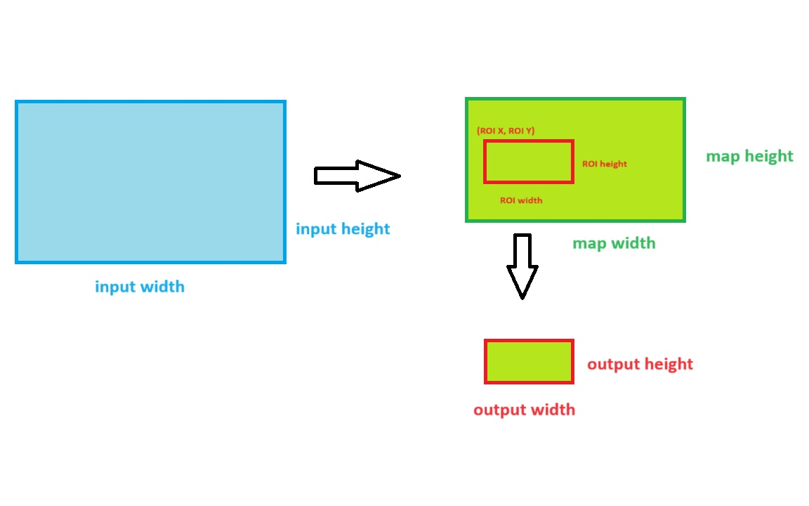

*Menu*:
- [1. Remap Overview](#1-remap-overview)
- [2. Remap Data Structures](#2-remap-data-structures)
- [3. Remap APIs](#3-remap-apis)
- [4. Remap examples](#4-remap-examples)
  - [4.1 Set configurations](#41-set-configurations)
  - [4.2 API Call flow](#42-api-call-flow)
  - [4.3 Supported pipelines](#43-supported-pipelines)

# 1. Remap Overview

The RideHal Remap component is based on [FastADAS Remap APIs](https://developer.qualcomm.com/sites/default/files/docs/adas-sdk/api/group__remap.html). It can do undistortion, downscaling, color conversion, normalization and ROI scaling in one singel API calling on specific processor(CPU, GPU or DSP). 

# 2. Remap Data Structures

- [Remap_InputConfig_t](../include/ridehal/component/Remap.hpp#L48)
- [Remap_Config_t](../include/ridehal/component/Remap.hpp#L64) 
- [Remap_MapTable_t](../include/ridehal/component/Remap.hpp#L35) 

# 3. Remap APIs 

- [Remap::Init](../include/ridehal/component/Remap.hpp#L85) 
- [Remap::RegisterBuffers](../include/ridehal/component/Remap.hpp#L97)
- [Remap::Start](../include/ridehal/component/Remap.hpp#L104) 
- [Remap::Execute](../include/ridehal/component/Remap.hpp#L115) 
- [Remap::Stop](../include/ridehal/component/Remap.hpp#L122) 
- [Remap::DeRegisterBuffers](../include/ridehal/component/Remap.hpp#L132) 
- [Remap::Deinit](../include/ridehal/component/Remap.hpp#L140) 

# 4. Remap examples

## 4.1 Set configurations

The remap configuration parameters of 2 different input images can be set as following example:
```c++
    Remap_Config_t RemapConfig;
    char pName[10] = "Remap";
    RemapConfig.processor = RIDEHAL_PROCESSOR_HTP0;
    RemapConfig.numOfInputs = 2;

    RemapConfig.inputConfigs[0].inputFormat = RIDEHAL_IMAGE_FORMAT_UYVY;
    RemapConfig.inputConfigs[0].inputWidth = 512;
    RemapConfig.inputConfigs[0].inputHeight = 512;
    RemapConfig.inputConfigs[0].mapWidth = 256;
    RemapConfig.inputConfigs[0].mapHeight = 256;
    RemapConfig.inputConfigs[0].ROI.x = 0;
    RemapConfig.inputConfigs[0].ROI.y = 0;
    RemapConfig.inputConfigs[0].ROI.width = 256;
    RemapConfig.inputConfigs[0].ROI.height = 256;

    RemapConfig.inputConfigs[1].inputFormat = RIDEHAL_IMAGE_FORMAT_UYVY;
    RemapConfig.inputConfigs[1].inputWidth = 768;
    RemapConfig.inputConfigs[1].inputHeight = 768;
    RemapConfig.inputConfigs[1].mapWidth = 512;
    RemapConfig.inputConfigs[1].mapHeight = 512;
    RemapConfig.inputConfigs[1].ROI.x = 256;
    RemapConfig.inputConfigs[1].ROI.y = 256;
    RemapConfig.inputConfigs[1].ROI.width = 256;
    RemapConfig.inputConfigs[1].ROI.height = 256;

    RemapConfig.outputFormat = RIDEHAL_IMAGE_FORMAT_RGB888;
    RemapConfig.outputWidth = 256;
    RemapConfig.outputHeight = 256;
    RemapConfig.bEnableUndistortion = false;
    RemapConfig.bEnableNormalize = true;
    RemapConfig.normlzR.sub = 0.0;
    RemapConfig.normlzR.mul = 1.0;
    RemapConfig.normlzR.add = 0.0;
    RemapConfig.normlzG.sub = 0.0;
    RemapConfig.normlzG.mul = 1.0;
    RemapConfig.normlzG.add = 0.0;
    RemapConfig.normlzB.sub = 0.0;
    RemapConfig.normlzB.mul = 1.0;
    RemapConfig.normlzB.add = 0.0;
```
The relationship of input, map, ROI, output scales are showed in following picture. The mapWidth must not be larger than inputWidth and the mapHeight must not be larger than inputHeight. The ROI.width+ROI.x must not be larger than mapWidth and the ROI.height+ROI.y must not be larger than mapHeight. The ROI.width must be equal to outputWidth and the ROI.height must be equal to output.height.


If bEnableUndistortion is set to true, user can do undistortion or lens distortion correction for fisheye type camera by using the calibrated mapping table mapX and mapY. The mapping table mapX and mapY are floating point matrixs, each element is the column/row coordinate of the mapped location in the source image. The following example show how to set a map table with linear resize. 
```c++
            RideHal_TensorProps_t mapXProp;
            mapXProp = {
                    RIDEHAL_TENSOR_TYPE_FLOAT_32,
                    { mapWidth, mapHeight, 0 },
                    2,
            };
            ret = mapXBuffer[inputId].Allocate( &mapXProp );
            RideHal_TensorProps_t mapYProp;
            mapYProp = {
                    RIDEHAL_TENSOR_TYPE_FLOAT_32,
                    { mapWidth, mapHeight, 0 },
                    2,
            };
            ret = mapYBuffer[inputId].Allocate( &mapYProp );
            ASSERT_EQ( RIDEHAL_ERROR_NONE, ret );
            float *mapX = (float *) mapXBuffer[inputId].data();
            float *mapY = (float *) mapYBuffer[inputId].data();
            for ( int i = 0; i < mapHeight; i++ )
            {
                for ( int j = 0; j < mapWidth; j++ )
                {
                    mapX[i * mapWidth + j] = (float) j / (float) mapWidth * (float) inputWidth;
                    mapY[i * mapWidth + j] = (float) i / (float) mapHeight * (float) inputHeight;
                }
            }
            RemapConfig.inputConfigs[inputId].remapTable.pMapX = &mapXBuffer[inputId];
            RemapConfig.inputConfigs[inputId].remapTable.pMapY = &mapYBuffer[inputId];
```

## 4.2 API Call flow

The typical call flow of a Ridehal Remap pipeline is showed as following example:
```c++
    RideHalError_e ret = RIDEHAL_ERROR_NONE;
    ret = RemapObj.Init( pName, pRemapConfig );
    RideHal_SharedBuffer_t inputs[RemapConfig.numOfInputs];
    for ( uint32_t inputId = 0; inputId < RemapConfig.numOfInputs; inputId++ )
    {
        ret = inputs[inputId].Allocate( RemapConfig.inputConfigs[inputId].inputWidth,
                                        RemapConfig.inputConfigs[inputId].inputHeight,
                                        RemapConfig.inputConfigs[inputId].inputFormat );
    }
    RideHal_SharedBuffer_t output;
    ret = output.Allocate( RemapConfig.numOfInputs, RemapConfig.outputWidth,
                           RemapConfig.outputHeight, RemapConfig.outputFormat );
    ret = RemapObj.RegisterBuffers( inputs, RemapConfig.numOfInputs, FADAS_BUF_TYPE_IN );
    ret = RemapObj.RegisterBuffers( &output, 1, FADAS_BUF_TYPE_OUT );
    ret = RemapObj.Execute( inputs, RemapConfig.numOfInputs, &output );
    ret = RemapObj.DeRegisterBuffers( inputs, RemapConfig.numOfInputs );
    ret = RemapObj.DeRegisterBuffers( &output, 1 );
    ret = RemapObj.Deinit();
```
Generally, user should call Init API once at the beginning of the pipeline and call Deinit API once at the ending of the pipeline.
Calling of RegisterBuffers and DeRegisterBuffers API for input/output buffer is optional, if the register/deregister step is not done by user explicitly, it would be done in execute/deinit step implicitly. 

## 4.3 Supported pipelines

The supported remap pipelines for different input/output image format on each processor are listed below. In which Y means supported, N means unsupported. And norm means pipeline with normalization, corresponding to bEnableNormalize = true in the configuration parameters. Note that the NV12 input pipelines of each processor are only supported with internal engineering fadas libraries, and only verified in specific QNX meta build(Snapdragon_Auto.HQX.4.5.6.0.1.r1-00010).

| Pipeline         | DSP processor | CPU processor | GPU processor |
|------------------|---------------|---------------|---------------|
| RGB  to RGB      |     Y         |     Y         |     Y         |
| RGB  to RGB norm |     N         |     N         |     N         |
| UYVY to RGB      |     Y         |     Y         |     Y         |
| UYVY to RGB norm |     Y         |     Y         |     Y         |
| UYVY to BGR      |     Y         |     N         |     Y         |
| UYVY to BGR norm |     N         |     N         |     N         |
| NV12 to RGB      |     N         |     Y         |     Y         |
| NV12 to RGB norm |     N         |     Y         |     Y         |
| NV12 to BGR      |     Y         |     N         |     Y         |
| NV12 to BGR norm |     N         |     N         |     N         |
| NV12 UBWC to BGR |     N         |     N         |     Y         |


Reference:
- [gtest_Remap](../tests/unit_test/components/Remap/gtest_Remap.cpp)
- [SampleRemap](../tests/sample/source/SampleRemap.cpp)
- [FastADAS Remap](https://developer.qualcomm.com/sites/default/files/docs/adas-sdk/api/group__remap.html)