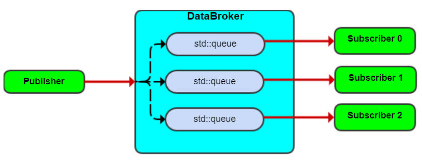

*Menu*:
- [1. QCNode buffer life cycle management between threads in the same process](#1-qcnode-buffer-life-cycle-management-between-threads-in-the-same-process)
  - [1.1 Using C++ std::shared\_ptr to do the QCNode buffer life cycle management](#11-using-c-stdshared_ptr-to-do-the-qcnode-buffer-life-cycle-management)
    - [1.1.1 The buffer life cycle management for Camera](#111-the-buffer-life-cycle-management-for-camera)
    - [1.1.2 The buffer life cycle management for the Video Encoder](#112-the-buffer-life-cycle-management-for-the-video-encoder)
    - [1.1.3 The buffer life cycle management of the SharedBufferPool](#113-the-buffer-life-cycle-management-of-the-sharedbufferpool)
- [2. QCNode buffer life cycle management between processes](#2-qcnode-buffer-life-cycle-management-between-processes)

# 1. QCNode buffer life cycle management between threads in the same process

## 1.1 Using C++ std::shared_ptr to do the QCNode buffer life cycle management

The [QCNode Sample Application](../tests/sample/README.md) is an application to demonstrate how to use the QCNode nodes. And here this document will introduce the buffer life cycle management that used by the QCNode Sample Application by using the C++ [std::shared_ptr](https://en.cppreference.com/w/cpp/memory/shared_ptr).

Generally, by customization of the "Deleter" function of the std::shared_ptr to do the buffer release at the end of its life cycle.

```c++
std::shared_ptr<SharedBuffer_t> buffer( pSharedBuffer, [&]( SharedBuffer_t *pSharedBuffer ) {
    // within the customized Deleter to do the specified buffer release action
} );
```

Note: As the QCNode Sample is a demo, it still has memory allocation during running after the initialization which was not good, for example for the above std::shared_ptr "buffer" construction, it's strongly suggested that to customize the allocation of the std::shared_ptr by using a std::shared_ptr allocation memory pool, refer [Allocator](https://en.cppreference.com/w/cpp/named_req/Allocator).

And as below 2 pictures shows, the C++ std::shared_ptr will be a part of the message that to be published by the single producer and can be received by the 1 or multiple consumers, thus it can ensure that when the last consumer release the std::shared_ptr, the customized "Deleter" function will be called to do the specified buffer release action.




### 1.1.1 The buffer life cycle management for Camera

Refer [SampleCamera::ProcessDoneCb](../tests/sample/source/SampleCamera.cpp#L15), when this callback from the Camera is called, it means that a **camera frame is ready**.

- This will finally **activate the related thread** to call [SampleCamera::ProcessFrame](../tests/sample/source/SampleCamera.cpp#L278).
- `ProcessFrame` will then **publish the camera frame info out** using the **QCNode DataBroker message queue**, allowing subscribers to consume it asynchronously.

```c++
void SampleCamera::ProcessFrame( CameraFrameDescriptor_t *pCamFrameDesc )
{
    DataFrames_t frames;
    DataFrame_t frame;
    uint32_t streamId = pCamFrameDesc->streamId;

    SharedBuffer_t *pSharedBuffer = new SharedBuffer_t;
    pSharedBuffer->SetBuffer( *pCamFrameDesc );
    pSharedBuffer->pubHandle = (uint64_t) pCamFrameDesc->frameIdx + ( (uint64_t) streamId << 32 );

    std::shared_ptr<SharedBuffer_t> buffer( pSharedBuffer, [&]( SharedBuffer_t *pSharedBuffer ) {
        CameraFrameDescriptor_t camFrameDesc;
        NodeFrameDescriptor frameDesc( 1 );

        uint32_t frameIdx = pSharedBuffer->pubHandle & 0xFFFFFFFFul;
        camFrameDesc = pSharedBuffer->imgDesc;
        camFrameDesc.frameIdx = frameIdx;
        camFrameDesc.streamId = pSharedBuffer->pubHandle >> 32;
        (void) frameDesc.SetBuffer( 0, camFrameDesc );

        ...
            m_camera.ProcessFrameDescriptor( frameDesc );
        ...

        delete pSharedBuffer;
    } );
    ...
    m_pub.Publish( frames );
}
```

### 1.1.2 The buffer life cycle management for the Video Encoder

Refer [SampleVideoEncoder::ThreadMain](../tests/sample/source/SampleVideoEncoder.cpp#L173) which will hold the shared camera buffer in the "m_camFrameMap" after successfully submit the camera frame to the Video Encoder.

```c++
void SampleVideoEncoder::ThreadMain()
{
    QCStatus_e ret;
    while ( false == m_stop )
    {
        DataFrames_t frames;
        DataFrame_t frame;
        ret = m_sub.Receive( frames );
        if ( 0 == ret )
        {
            frame = frames.frames[0];
            ...
            {
                std::lock_guard<std::mutex> l( m_lock );
                m_camFrameMap[frame.frameId] = frame;
                // hold the shared camera frame until the callback "InFrameCallback"
            }
            ...
            ret = m_encoder.ProcessFrameDescriptor( frameDesc );
            ...
        }
    }
}
```

Refer [SampleVideoEncoder::InFrameCallback](../tests/sample/source/SampleVideoEncoder.cpp#L33), when this callback from the Video Encoder is called, it means that the **shared camera frame is fully consumed by the Video Encoder**.

- This will then **activate the related thread** to erase the shared camera frame from `m_camFrameMap`.
- By erasing the entry, the camera frame is **released back to the Camera** for reuse.


```c++
void SampleVideoEncoder::ThreadProcMain()
{
    ...
    auto it = m_camFrameMap.find( frameId );
    if ( it != m_camFrameMap.end() )
    {   /* release the input camera frame */
        m_camFrameMap.erase( frameId );
    }
    ...
}
```

Refer [SampleVideoEncoder::OutFrameCallback](../tests/sample/source/SampleVideoEncoder.cpp#L48), when this callback from the Video Encoder is called, it means that an **encoded video frame is ready**.

```c++
void SampleVideoEncoder::OutFrameCallback( VideoFrameDescriptor &outFrame )
{
    ...
    DataFrames_t frames;
    DataFrame_t frame;

    SharedBuffer_t *pSharedBuffer = new SharedBuffer_t;
    pSharedBuffer->SetBuffer( outFrame );
    pSharedBuffer->pubHandle = 0;
    ...
    std::shared_ptr<SharedBuffer_t> buffer( pSharedBuffer, [&]( SharedBuffer_t *pSharedBuffer ) {
        VideoFrameDescriptor buffDesc;
        buffDesc = pSharedBuffer->GetBuffer();

        NodeFrameDescriptor frameDesc( QC_NODE_VIDEO_ENCODER_OUTPUT_BUFF_ID + 1 );
        frameDesc.SetBuffer( QC_NODE_VIDEO_ENCODER_OUTPUT_BUFF_ID, buffDesc );

        m_encoder.ProcessFrameDescriptor( frameDesc );
        delete pSharedBuffer;
    } );
    ...
        m_pub.Publish( frames );
    ...
}
```

### 1.1.3 The buffer life cycle management of the SharedBufferPool

The QCNode Sample [SharedBufferPool](../tests/sample/include/QC/sample/SharedBufferPool.hpp#L168) gives a demo that how to create a ping-pong buffer pool that the buffer can be shared between threads in the process. It was by using a flag ["dirty"](../tests/sample/include/QC/sample/SharedBufferPool.hpp#L282) for each buffer to indicate whether the buffer is in use(dirty = true) or free (dirty = false).

Here it was the ["Get"](../tests/sample/source/SharedBufferPool.cpp#L43) API to try to get a free buffer from the pool, as the code shows, if no buffer's flag "dirty" is false, a nullptr will be returned to indicate that all buffers are in busy state which means still hold in the DataBroker queue or hold by the consumers.

```c++
std::shared_ptr<SharedBuffer_t> SharedBufferPool::Get()
{
    ...

    uint32_t idx = 0;
    auto it = m_queue.begin();
    for ( ; it != m_queue.end() && __atomic_load_n( &it->dirty, __ATOMIC_RELAXED ); it++, idx++ )
    {
    }

    if ( it == m_queue.end() )
    {
        ...
        return nullptr;
    }
    __atomic_store_n( &it->dirty, true, __ATOMIC_RELAXED );
    ...
    std::shared_ptr<SharedBuffer_t> ptr( &it->sharedBuffer,
                                         [&]( SharedBuffer_t *p ) { Deleter( p ); } );
    return ptr;
}
```

Please note the Get API is not thread safe, this API must be ensured to be only called by only 1 producer in 1 thread only.

Here it's ["Deleter" function](../tests/sample/source/SharedBufferPool.cpp#L63) that to release the buffer back to the pool.

```c++
void SharedBufferPool::Deleter( SharedBuffer_t *ptrToDelete )
{
    ...
    __atomic_store_n( &m_queue[ptrToDelete->pubHandle].dirty, false, __ATOMIC_RELAXED );
    ...
}
```

And refer the [SampleRemap](../tests/sample/source/SampleRemap.cpp#L206) or [SampleQnn](../tests/sample/source/SampleQnn.cpp#L128) to know how to use this SharedBufferPool.


# 2. QCNode buffer life cycle management between processes

- Refer the [SampleSharedRing](../tests/sample/source/SampleSharedRing.cpp).
- Refer the [SharedPublisher](../tests/sample/include/QC/sample/shared_ring/SharedPublisher.hpp).
- Refer the [SharedPublisher](../tests/sample/include/QC/sample/shared_ring/SharedPublisher.hpp).