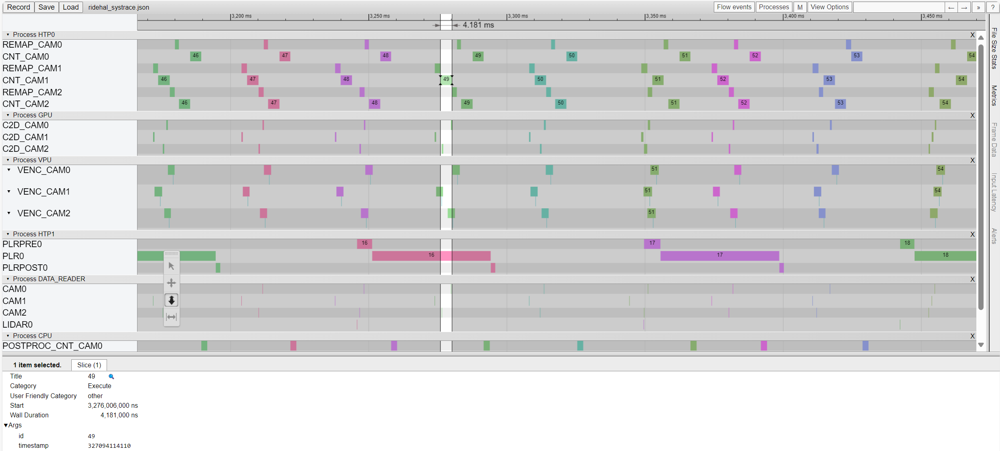

# QC SysTrace parse and generation tool

The QCNodeSampleApp supports to collect QC component events and generate a final systrace report that can be visualized by the web browser tool [chrome://tracing/](chrome://tracing/) or [edge://tracing/](edge://tracing/). Through the "Load" button to load the QC systrace json file.

## Collect the QC Systrace bin file

Before start the QCNodeSampleApp, the environment variable "QC_NODETRACE" must be specified to turn on the QCNodeSampleApp systrace. if no environment "QC_NODETRACE" or it was not correct specified, the systrace will be off.

Below is a sample command to specify environment "QC_NODETRACE" that the QCNodeSampleApp will save the systrace events into file "/tmp/qcnode_systrace.bin"

```sh
export QC_NODETRACE=/tmp/qcnode_systrace.bin
```

After the environment "QC_NODETRACE" was specified, start to run the QCNodeSampleApp and let it run for a while as wished and then stop it.

And pull the file "/tmp/qcnode_systrace.bin" from the target device to a ubuntu host PC.

## Parse and generate the systrace json file.

Using below command to convert the QC systrace bin file to a json file, but please use python version "3.x".

```sh
python scripts/utils/systrace/systrace.py -i qcnode_systrace.bin  -o qcnode_systrace.json
```

Then the file qcnode_systrace.json is the final output file that can be loaded by web tool [chrome://tracing/](chrome://tracing/) or [edge://tracing/](edge://tracing/).

Below image shows a demo of this tool.




# Desing reference

[[0]: Trace Event Format](https://docs.google.com/document/d/1CvAClvFfyA5R-PhYUmn5OOQtYMH4h6I0nSsKchNAySU/preview#heading=h.yr4qxyxotyw)
