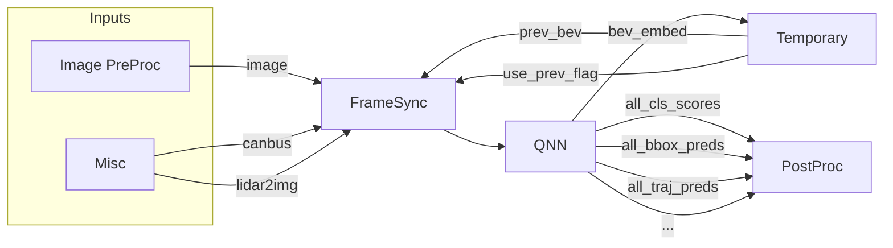

*Menu*:
- [QCNode Sample Application](#qcnode-sample-application)
  - [1. QCNode Sample Application command line arguments](#1-qcnode-sample-application-command-line-arguments)
  - [2. QCNode Samples](#2-qcnode-samples)
    - [2.1 QCNode DataReader Sample](#21-qcnode-datareader-sample)
    - [2.2 QCNode Camera Sample](#22-qcnode-camera-sample)
    - [2.3 QCNode C2D Sample](#23-qcnode-c2d-sample)
    - [2.4 QCNode Remap Sample](#24-qcnode-remap-sample)
    - [2.5 QCNode Qnn Sample](#25-qcnode-qnn-sample)
    - [2.6 QCNode PostProcCenternet Sample](#26-qcnode-postproccenternet-sample)
    - [2.7 QCNode TinyViz Sample](#27-qcnode-tinyviz-sample)
    - [2.8 QCNode VideoEncoder Sample](#28-qcnode-videoencoder-sample)
    - [2.9 QCNode Recorder Sample](#29-qcnode-recorder-sample)
    - [2.10 QCNode PlrPre Sample](#210-qcnode-plrpre-sample)
    - [2.11 QCNode PlrPost Sample](#211-qcnode-plrpost-sample)
    - [2.12 QCNode DataOnline Sample](#212-qcnode-dataonline-sample)
    - [2.13 QCNode CL2DFlex Sample](#213-qcnode-cl2dflex-sample)
    - [2.14 QCNode GL2DFlex Sample](#214-qcnode-gl2dflex-sample)
    - [2.15 QCNode Shared Ring Sample](#215-qcnode-shared-ring-sample)
    - [2.16 QCNode FpsAdapter Sample](#216-qcnode-fpsadapter-sample)
    - [2.17 QCNode VideoDecoder Sample](#217-qcnode-videodecoder-sample)
    - [2.18 QCNode OpticalFlow Sample](#218-qcnode-opticalflow-sample)
    - [2.19 QCNode OpticalFlowViz Sample](#219-qcnode-opticalflowviz-sample)
    - [2.20 QCNode FrameSync Sample](#220-qcnode-framesync-sample)
    - [2.21 QCNode DepthFromStereo Sample](#221-qcnode-depthfromstereo-sample)
    - [2.22 QCNode DepthFromStereoViz Sample](#222-qcnode-depthfromstereoviz-sample)
    - [2.23 QCNode VideoDemuxer Sample](#223-qcnode-videodemuxer-sample)
    - [2.24 QCNode Radar Sample](#224-qcnode-radar-sample)
    - [2.25 QCNode C2C Sample](#225-qcnode-c2c-sample)
    - [2.26 QCNode Temporal Sample](#226-qcnode-temporal-sample)
  - [3. Typical QCNode Sample Application pipelines](#3-typical-qcnode-sample-application-pipelines)
    - [3.1 4 DataReader based QNN perception pipelines](#31-4-datareader-based-qnn-perception-pipelines)
    - [3.2 1 DataReader and 1 Camera AR231 based QNN perception pipelines](#32-1-datareader-and-1-camera-ar231-based-qnn-perception-pipelines)
    - [3.3 1 DataReader based Pointpillar QNN perception pipelines](#33-1-datareader-based-pointpillar-qnn-perception-pipelines)
    - [3.4 1 QNN model data online inference pipeline](#34-1-qnn-model-data-online-inference-pipeline)
    - [3.5 1 QNN model data online shared memory between process pipeline](#35-1-qnn-model-data-online-shared-memory-between-process-pipeline)

# QCNode Sample Application

This QCNode sample is an application to demonstrate how to use the QCNode components.

## 1. QCNode Sample Application command line arguments

Below is a sample that how to use command line arguments to tell the QCNode sample application to create the component with the specified arguments.

```sh
export QC_LOG_LEVEL=INFO
./bin/qcrun ./bin/QCNodeSampleApp \
  -n component0_name -t component0_type \
    -k component0_attr1_name -v component0_attr1_value \
    -k component0_attr2_name -v component0_attr2_value \
    ... \
  -n componentX_name -t componentX_type \
    -k componentX_attr1_name -v componentX_attr1_value \
    -k componentX_attr2_name -v componentX_attr2_value \
```

Note: the "-n componentX_name -t componentX_type" must be in the begin for each component, and all the repeated "-k componentX_attr?_name -v componentX_attr?_value" are going to specify the attributes for this component.

| parameter | required | type      | comments |
|-----------|----------|-----------|----------|
| -n        | true     | string    | The unique component name |
| -t        | true     | string    | The component type name, options from [DataReader, Camera, Remap, Qnn, C2D, PostProcCenternet, TinyViz, VideoEncoder, VideoDecoder, Recorder, PlrPre, PlrPost, DataOnline, CL2DFlex, GL2DFlex, SharedRing, FpsAdapter, OpticalFlow, OpticalFlowViz, FrameSync, DepthFromStereo, DepthFromStereoViz, Radar, C2C, Temporal] |
| -k        | true     | string    | The unique component attribute name |
| -v        | true     | string    | The attribute value for the previous attribute name |
| -d        | false    |   -       | Direct the QCNode log to stdout |
| -T        | false    | int       | Specify the time in seconds that the QCNodeSampleApp runs, if not specified or value 0, it means that the QCNodeSampleApp will run forever until stop signal(Ctrl + C).  |

## 2. QCNode Samples

### 2.1 QCNode DataReader Sample

| attribute | required | type      | default | comments |
|-----------|----------|-----------|---------|----------|
| number    | false    | int       | 1       | The number of simulated sensors |
| typeX     | false    | string    | "image"  | The buffer type for the simulated sensor X, options from [image, tensor] |
| formatX   | false    | string    | "nv12"  | The image format for the simulated camera X, options from [nv12, uyvy, rgb, bgr, p010, nv12_ubwc] |
| widthX    | false    | int       | 1920    | The image width for the simulated camera X |
| heightX   | false    | int       | 1024    | The image height for the simulated camera X |
| data_pathX | true    | string    | -       | The data path for the simulated sensor X that contain the image files |
| tensor_typeX | false | string    | float32 | The tensor type, options from [int8, int16, int32, int64, uint8, uint16, uint32, uint64, float16, float32, float64, sfixed_point8, sfixed_point16, sfixed_point32, ufixed_point8, ufixed_point16, ufixed_point32 ] |
| dimsX     | true     | string    | -       | The tensor dimensions, in format "N,H,W,C", "N,S,C", "N,C", or "N" depends on the number of dimensions. |
| offset   | false    | int      | 0    | Specifies the starting index for the simulated sensor data. |
| fps       | false    | int       | 30      | The frame rate per second |
| pool_size | false    | int       | 4       | the image memory pool size |
| cache     | false    | bool      | true    | use cached memory or not for the image memory |
| topic     | true     | string    | -       | the output topic name |

Note: "X" is value from 0 to number-1, thus the attribute with suffix "X" is repeated for different simulated camera.

The command line template example for image type data reader that simulate a camera:

```sh
  -n CAM0 -t DataReader -k number -v 1 \
    -k format0 -v uyvy -k width0 -v 1920 -k height0 -v 1024 \
    -k data_path0 -v /data/4K_street_1000_500_1920_1024_uyvy \
    -k pool_size -v 4 \
    -k topic -v /sensor/camera/CAM0/raw \
```

Refer [DataReader Utils](../../scripts/utils/data_reader/README.md#L2) for how to generate a data reader inputs from video(*.mp4).

The command line template example for tensor type data reader that simulate a lidar:

```sh
  -n LIDAR0 -t DataReader -k number -v 2 \
    -k type0 -v tensor -k tensor_type0 -v float32 -k dims0 -v "300000,4"  \
    -k data_path0 -v /data/LIDAR0 \
    -k type1 -v image -k format1 -v nv12 -k width1 -v 1920 -k height1 -v 1024 \
    -k data_path1 -v /data/LIDAR0 \
    -k pool_size -v 4 -k fps -v 10 \
    -k topic -v /sensor/lidar/LIDAR0/raw \
```

Please note that for lidar pipeline, TinyViz was used to visualize the pointcould, and to save computing resource to dynamic generate images from pointcloud, pre-generated images was used, that's why another "data_path1".

Refer [DataReader Utils](../../scripts/utils/data_reader/README.md#L38) for how to generate a data reader inputs point cloud files.

### 2.2 QCNode Camera Sample

| attribute | required | type      | default | comments |
|-----------|----------|-----------|---------|----------|
| number    | false    | int       | 1       | The number of camera streams |
| client_id | false    | int       | 0       | client id, used for multi client usecase, set to 0 by default for single client usecase  |
| is_primary| false    | bool      | false   | Flag to indicate if the session is primary or not when configured the clientId |
| recovery  | false    | bool      | false   | Flag to enable the self-recovery for the session |
| input_id  | true     | int       | -       | The camera input id |
| src_id    | false    | int       | 0       | Input source identifier |
| input_mode | false   | int       | 0       | The input mode id |
| width     | true     | int       | -       | The image width for the stream 0 |
| height    | true     | int       | -       | The image height for the stream 0 |
| format    | false    | string    | "nv12"  | The camera frame format for the stream 0, options from [nv12, uyvy, p010, nv12_ubwc, tp10_ubwc, rgb, bgr] |
| stream_id | false    | int       | 0       | The camera stream id for the stream 0 |
| pool_size | false    | int       | 4       | The image memory pool size for the stream 0 |
| submit_request_pattern | false | int       | 0  | The submit request pattern for the stream 0 |
| request_mode | false | bool      | false   | The camera request mode |
| frame_drop_patten | false | int  | 0       | The frame drop patten defined by qcarcam |
| frame_drop_period | false | int  | 0       | The frame drop period defined by qcarcam |
| isp_use_case | false | int       | 3       | The ISP use case |
| op_mode   | false    | int       | 2       | The input operation mode, 1: Inline ISP, 2: Injection to ISP. |
| ignore_error | false | bool      | false   | Ignore the error of Camera Init&Start |
| immediate_release | false | bool | false   | Perform an immediate camera frame release in the camera frame ready callback if true. Be cautious, as this approach does not provide life cycle management for the camera buffer, and data consistency is not guaranteed. |
| topic     | true     | string    | -       | The output topic name |
| widthX     | false   | int       | -       | The image width for the stream X |
| heightX    | false   | int       | -       | The image height for the stream X |
| formatX    | false   | string    | "nv12"  | The camera frame format for the stream X, options from [nv12, uyvy, p010, nv12_ubwc, tp10_ubwc, rgb, bgr] |
| stream_idX | false   | int       | ${X}       | The camera stream id for the stream X |
| pool_sizeX | false   | int       | 4       | The image memory pool size for the stream X |
| submit_request_patternX | false | int       | 0  | The submit request pattern for the stream X |
| topicX     | false   | string    | -       | The output topic name for the stream X |

Note: "X" is value from 1 to number-1, thus the attribute with suffix "X" is repeated for different streams.

The command line template example:

```sh
  -n CAM0 -t Camera -k input_id -v 0 \
    -k width -v 1928 -k height -v 1208 \
    -k request_mode -v false \
    -k topic -v /sensor/camera/CAM0/raw \
```

```sh
  -n IMX728_0 -t Camera -k input_id -v 0 -k number -v 2 \
    -k stream_id -v 0 -k width -v 1920 -k height -v 1080 -k format -v nv12_ubwc \
    -k stream_id1 -v 1 -k width1 -v 3840 -k height1 -v 2160 -k format1 -v nv12_ubwc \
    -k submit_request_pattern1 -v 3 \
    -k isp_use_case -v 135 \
    -k request_mode -v true -k pool_size -v 4 \
    -k topic -v /sensor/camera/IMX728_0/raw \
    -k topic1 -v /sensor/camera/IMX728_0_S1/raw \
```

### 2.3 QCNode C2D Sample

| attribute     | required | type      | default | comments |
|---------------|----------|-----------|---------|----------|
| output_width  | false    | int       | 1920    | The output image width |
| output_height | false    | int       | 1024    | The output image height |
| output_format | false    | string    | nv12     | The output image format, options from [uyvy, nv12, rgb, bgr, p010 ]|
| batch_size    | false    | int       | 1       | The Remap input batch size |
| input_widthX  | false    | int       | 1920    | The input X image width |
| input_heightX | false    | int       | 1024    | The input X image height |
| input_formatX | false    | string    | uyvy    | The input X image format, options from [uyvy, nv12, rgb, bgr, p010 ]|
| roi_xX        | false    | int       | 0       | The ROI top x for input X |
| roi_yX        | false    | int       | 0       | The ROI top y for input X |
| roi_widthX    | false    | int       | =output_width  | The ROI width for input X |
| roi_heightX   | false    | int       | =output_height | The ROI height for input X |
| pool_size     | false    | int       | 4       | the image memory pool size |
| cache         | false    | bool      | true    | use cached memory or not for the image memory |
| input_topic   | true     | string    | -       | the input topic name |
| output_topic  | true     | string    | -       | the output topic name |

Note: "X" is value from 0 to batch_size-1, thus the attribute with suffix "X" is repeated for different input batch.

The command line template example:

```sh
  -n C2D0 -t C2D -k batch_size -v 1 \
    -k input_width0 -v 2048 -k input_height0 -v 1216 -k input_format0 -v nv12 \
    -k roi_x0 -v 0 -k roi_y0 -v 0 -k roi_width0 -v 1928 -k roi_height0 -v 1208 \
    -k output_width -v 2048 -k output_height -v 1216 -k output_format -v uyvy \
    -k input_topic -v /sensor/camera/CAM0/raw \
    -k output_topic -v /sensor/camera/CAM0/uyvy \
    -k cache -v false
```

### 2.4 QCNode Remap Sample

| attribute     | required | type      | default | comments |
|---------------|----------|-----------|---------|----------|
| processor     | false    | string    | "htp0"  | The processor type, options from [htp0, htp1, cpu, gpu] |
| rsm_priority  | false     | int    | 0       | the RSM request priority, options [0,1,2,3], 0 is the lowest and 3 is highest priority. |
| output_width  | false    | int       | 1152    | The output image width |
| output_height | false    | int       | 800     | The output image height |
| output_format | false    | string    | rgb     | The output image format, options from [rgb, bgr]|
| batch_size    | false    | int       | 1       | The Remap input batch size |
| input_widthX  | false    | int       | 1920    | The input X image width |
| input_heightX | false    | int       | 1024    | The input X image height |
| input_formatX | false    | string    | uyvy    | The input X image format, options from [uyvy, nv12, nv12_ubwc]|
| map_widthX    | false    | int       | =output_width  | The map width for input X |
| map_heightX   | false    | int       | =output_height | The map height for input X |
| roi_xX        | false    | int       | 0       | The ROI top x for input X |
| roi_yX        | false    | int       | 0       | The ROI top y for input X |
| roi_widthX    | false    | int       | =output_width  | The ROI width for input X |
| roi_heightX   | false    | int       | =output_height | The ROI height for input X |
| pool_size     | false    | int       | 4       | the image memory pool size |
| normalize     | false    | bool      | true    | enable or disable normalization |
| map_table     | false    | bool      | false   | enable or disable create map from map table pointers |
| mapX_pathX    | false    | string    | "./data/test/remap/mapX.raw"   | map table path of width direction for input X |
| mapY_pathX    | false    | string    | "./data/test/remap/mapY.raw"   | map table path of height direction for input X |
| quant_scale   | false    | float     | 0.0186584480106831 | The quantization scale of the quantize model input  |
| quant_offset  | false    | int       | 114     | The quantization offset of the quantize model input |
| Rsub          | false    | float     | 123.675 | The sub normalization parameter of R channel  |
| Rmul          | false    | float     | 0.0171  | The mul normalization parameter of R channel  |
| Radd          | false    | float     | 0.0     | The add normalization parameter of R channel  |
| Gsub          | false    | float     | 116.28  | The sub normalization parameter of G channel  |
| Gmul          | false    | float     | 0.0175  | The mul normalization parameter of G channel  |
| Gadd          | false    | float     | 0.0     | The add normalization parameter of G channel  |
| Bsub          | false    | float     | 103.53  | The sub normalization parameter of B channel  |
| Bmul          | false    | float     | 0.0174  | The mul normalization parameter of B channel  |
| Badd          | false    | float     | 0.0     | The add normalization parameter of B channel  |
| input_topic   | true     | string    | -       | the input topic name |
| output_topic  | true     | string    | -       | the output topic name |

Note: "X" is value from 0 to batch_size-1, thus the attribute with suffix "X" is repeated for different input batch.

The command line template example:

```sh
  -n REMAP0 -t Remap -k batch_size -v 1 \
    -k input_width0 -v 2048 -k input_height0 -v 1216 -k input_format0 -v uyvy \
    -k output_width -v 1152 -k output_height -v 800 -k output_format -v rgb \
    -k input_topic -v /sensor/camera/CAM0/uyvy \
    -k output_topic -v /sensor/camera/CAM0/remap \
```

### 2.5 QCNode Qnn Sample

| attribute     | required | type      | default | comments |
|---------------|----------|-----------|---------|----------|
| processor     | false    | string    | "htp0"  | The processor type, options from [htp0, htp1, cpu, gpu] |
| core_ids      | false    | int list  | 0       | Comma-separated list of core IDs on which the QNN model will run. |
| rsm_priority  | false     | int    | 0       | the RSM request priority, options [0,1,2,3], 0 is the lowest and 3 is highest priority. |
| async         | fasle    | bool      | false   | If true, enable to use QNN Async Execute API, else use QNN Sync Execute API. |
| model_path    | true     | string    | -       | The QNN model path |
| image_convert         | false    | string    | default | The image convert method for input image, options from [default, gray, chroma_first]. `default`: the default way to convert the image to 1 or more tenors. `gray`: convert the image to 1 tensor with the gray(luminance) part of the image. `chroma_first`: the same as `default` for NV12 or P010, but with chroma tensor first and then luma tensor. |
| pool_size     | false    | int       | 4       | the image memory pool size |
| input_topic   | true     | string    | -       | the input topic name |
| output_topic  | true     | string    | -       | the output topic name |
| udo           | false    | string    | -       | udo lib path and interface provider name. e.g. libQnnAutoAiswOpPackage.so:AutoAiswOpPackageInterfaceProvider |
| model_io_info_topic | false    | string    | ""       | if configured, this topic will be used to publish the input/output tensor informatin of the model, generally used by the QCNode DataOnline Sample for the QNN online inference.  |
| perf_profile | false | string    | `default`  | Specifies perf profile to set. <br> Options: `low_balanced`, `balanced`, `default`, `high_performance`, `sustained_high_performance`, `burst`, `low_power_saver`, `power_saver`, `high_power_saver`, `extreme_power_saver` <br> Default: `default` |
| weight_sharing_enabled | fasle    | bool      | false   | If true, enable the weight sharing. |
| extended_udma  | fasle    | bool      | false   | If true, enable the extended udma feature. |

The command line template example:

```sh
  -n CNT0 -t Qnn -k processor -v htp0 \
    -k model_path -v data/centernet/program.bin \
    -k input_topic -v /sensor/camera/CAM0/remap \
    -k output_topic -v /sensor/camera/CAM0/qnn \
```

### 2.6 QCNode PostProcCenternet Sample

| attribute     | required | type      | default | comments |
|---------------|----------|-----------|---------|----------|
| processor     | false    | string    | "cpu"   | The processor type, options from [cpu, gpu] |
| roi_x         | false    | int       | 0       | The ROI top x |
| roi_y         | false    | int       | 0       | The ROI top y |
| width         | false    | int       | 1920    | The ROI width |
| height        | false    | int       | 1024    | The ROI height |
| score_threshold | false  | float     | 0.6     | The score threshold |
| nms_threshold   | false  | float     | 0.6     | The NMS threshold |
| pool_size     | false    | int       | 4       | the image memory pool size |
| input_topic   | true     | string    | -       | the input topic name |
| output_topic  | true     | string    | -       | the output topic name |

The command line template example:

```sh
  -n POSTPROC_CNT0 -t PostProcCenternet \
    -k processor -v cpu \
    -k width -v 1928 -k height -v 1028 \
    -k input_topic -v /sensor/camera/CAM0/qnn \
    -k output_topic -v /sensor/camera/CAM0/objs \
```

### 2.7 QCNode TinyViz Sample

| attribute     | required | type        | default | comments |
|---------------|----------|-------------|---------|----------|
| winW          | false    | int         | 1920    | The window width |
| winH          | false    | int         | 1080    | The window height |
| cameras       | true     | string list | -       | The cameras' name list |
| cam_topicX    | false    | string      | /sensor/camera/${cameras[X]}/raw   | the input camera frame topic name for camera X |
| obj_topicX    | false    | string      | /sensor/camera/${cameras[X]}/objs  | the input road object topic name for camera X |
| batch_indexX  | false    | int         | 0       | The camera frame index in the data frames |

The command line template example:

```sh
  -n VIZ -t TinyViz -k cameras -v CAM0,CAM1,CAM2,CAM3
```

The command line template example for Lidar pipeline:

```sh
  -n VIZ -t TinyViz -k cameras -v LIDAR0 \
    -k batch_index0 -v 1 \
    -k cam_topic0 -v /sensor/lidar/LIDAR0/raw \
    -k obj_topic0 -v /sensor/lidar/LIDAR0/objs
```


### 2.8 QCNode VideoEncoder Sample

| attribute          | required | type      | default     | comments |
|--------------------|----------|-----------|-------------|----------|
| width              | true     | int       | -           | The image width |
| height             | true     | int       | -           | The image height |
| pool_size          | false    | int       | 4           | The image memory pool size |
| bitrate            | false    | int       | 8000000     | The encoding bitrate |
| fps                | false    | int       | 30          | The frame rate per second |
| input_topic        | true     | string    | -           | the input topic name |
| output_topic       | true     | string    | -           | the output topic name |
| format             | false    | string    | "nv12"      | The image format, options from [nv12, nv12_ubwc] |
| output_format      | false    | string    | h265        | The output image format, options from [h264, h265] |
| numInputBufferReq  | false    | int       | $pool_size  | Number of input buffers |
| numOutputBufferReq | false    | int       | $pool_size  | Number of output buffers |

The command line template example:

```sh
  -n VENC0 -t VideoEncoder -k width -v 1920 -k height -v 1024 \
    -k bitrate -v 8000000 \
    -k input_topic -v /sensor/camera/CAM0/raw \
    -k output_topic -v /sensor/camera/CAM0/hevc \
```

### 2.9 QCNode Recorder Sample

| attribute     | required | type      | default | comments |
|---------------|----------|-----------|---------|----------|
| max           | false    | int       | 1000    | The maximum recorded images |
| topic         | true     | string    | -       | the input topic name |

For compressed image format, all the images are saved into 1 file with name "/tmp/\${name}.raw".
For the non-compressed image format, with separated images with name "/tmp/${name}\_\${id}\_\${batch_id}.raw" to save the real image content.
The file with name "/tmp/\${name}.meta" is used to record image information, below is an example:

```sh
$ cat /tmp/REC0.meta
0: frameId 0 timestamp 322037864334718: batch=3 resolution=1024x768 stride=2048 actual_height=768 format=2
$ ls -l /tmp/*.raw
-rw-rw-r--   2 root      root        1572864 Jan 04 17:27 /tmp/REC0_0_0.raw
-rw-rw-r--   2 root      root        1572864 Jan 04 17:27 /tmp/REC0_0_1.raw
-rw-rw-r--   2 root      root        1572864 Jan 04 17:27 /tmp/REC0_0_2.raw
-rw-rw-r--   2 root      root            107 Jan 04 17:27 /tmp/REC0.meta
```

The command line template example:

```sh
  -n REC0 -t Recorder -k max -v 100 -k topic -v /sensor/camera/CAM0/hevc \
```

### 2.10 QCNode PlrPre Sample

| attribute     | required | type      | default | comments |
|---------------|----------|-----------|---------|----------|
| processor     | false    | string    | "htp0"  | The processor type, options from [htp0, htp1, cpu, gpu] |
| rsm_priority  | false     | int    | 0       | the RSM request priority, options [0,1,2,3], 0 is the lowest and 3 is highest priority. |
| pillar_size_x | false    | float     | 0.16    | Pillar size in x direction in meters |
| pillar_size_y | false    | float     | 0.16    | Pillar size in y direction in meters |
| pillar_size_z | false    | float     | 4.0     | Pillar size in z direction in meters |
| min_x         | false    | float     | 0.0     | Minimum range value in x direction |
| min_y         | false    | float     | -39.68  | Minimum range value in y direction |
| min_z         | false    | float     | -3.0    | Minimum range value in z direction |
| max_x         | false    | float     | 69.12   | Maximum range value in x direction |
| max_y         | false    | float     | 39.68   | Maximum range value in x direction |
| max_z         | false    | float     | 1       | Maximum range value in x direction |
| max_points    | false    | int       | 300000  | Maximum number of points in input point cloud |
| in_feature_dim | false   | int       | 4       | Number of features for each point in the input point cloud data |
| max_pillars    | false   | int       | 12000   | Maximum number of point pillars that can be created |
| max_points_per_pillar | false | int  | 32       | Maximum number of pMaximum number of points to map to each pillar |
| out_feature_dim | false  | int       | 10      | Number of features for each point in point pillars |
| input_mode    | false    | string    | "xyzr"  | The input pointclouds type used for OpenCL implementation, options from [xyzr, xyzrt] |
| pool_size     | false    | int       | 4       | the image memory pool size |
| input_topic   | true     | string    | -       | the input topic name |
| output_topic  | true     | string    | -       | the output topic name |

The command line template example:

```sh
  -n PLRPRE0 -t PlrPre -k processor -v htp0 \
    -k input_topic -v /sensor/lidar/LIDAR0/raw \
    -k output_topic -v /sensor/lidar/LIDAR0/plrpre \
```

### 2.11 QCNode PlrPost Sample

| attribute     | required | type      | default | comments |
|---------------|----------|-----------|---------|----------|
| processor     | false    | string    | "htp0"  | The processor type, options from [htp0, htp1, cpu] |
| rsm_priority  | false     | int    | 0       | the RSM request priority, options [0,1,2,3], 0 is the lowest and 3 is highest priority. |
| pillar_size_x | false    | float     | 0.16    | Pillar size in x direction in meters |
| pillar_size_y | false    | float     | 0.16    | Pillar size in y direction in meters |
| min_x         | false    | float     | 0.0     | Minimum range value in x direction |
| min_y         | false    | float     | -39.68  | Minimum range value in y direction |
| max_x         | false    | float     | 69.12   | Maximum range value in x direction |
| max_y         | false    | float     | 39.68   | Maximum range value in x direction |
| max_points    | false    | int       | 300000  | Maximum number of points in input point cloud |
| in_feature_dim | false   | int       | 4       | Number of features for each point in the input point cloud data |
| max_det_out    | false   | int       | 500     | Maximum number of 3D bounding boxes expected in the output |
| stride        | false    | int       | 2       | The downsample ratio |
| thresh_score  | false    | float     | 0.4     | Confidence score threshold |
| thresh_iou    | false    | float     | 0.4     | NMS Overlap threshold |
| offset_x      | false    | float     | 514     | The min_x corresponding pixel position x of the pre-generated lidar image |
| offset_y      | false    | float     | 514     | The min_y corresponding pixel position y of the pre-generated lidar image |
| ratio_w      | false    | float | 12.903225806451614 | The ration to transfrom the point cloud position x to image pixel position x |
| ratio_h      | false    | float | 12.903225806451614 | The ration to transfrom the point cloud position y to image pixel position y |
| debug      | false    | bool | false | print out the detected 3d bounding box |
| output_indexs | false | int list | 3,0,1,4,2 | The index of the pointpillar model outputs "heapmap", "center", "center_z", "dim" and "rot" |
| input_topic   | true     | string    | -       | the input topic name |
| output_topic  | true     | string    | -       | the output topic name |

The command line template example:

```sh
  -n PLRPOST0 -t PlrPost -k processor -v htp0 -k debug -v false \
    -k input_lidar_topic -v /sensor/lidar/LIDAR0/raw \
    -k input_topic -v /sensor/lidar/LIDAR0/qnn \
    -k output_topic -v /sensor/lidar/LIDAR0/objs
```

### 2.12 QCNode DataOnline Sample

| attribute     | required | type      | default | comments |
|---------------|----------|-----------|---------|----------|
| port          | false    | int       | 6666    | The TCP server socket port number |
| pool_size     | false    | int       | 4       | the image memory pool size |
| input_topic   | true     | string    | -       | the input topic name |
| output_topic  | true     | string    | -       | the output topic name |
| model_io_info_topic | false    | string    | "/data/online/${name}/model/info"       | This topic will be used to subscribe the input/output tensor informatin of the QNN model which will consume the online datas from host PC tool.  |
| cache         | false    | bool      | true    | use cached memory or not for the buffer pool |
| timeout       | false    | int      | 2    | socket send timeout in seconds |

The command line template example:

```sh
  -n DO0 -t DataOnline -k port -v 6666 \
    -k input_topic -v /data/online/DO0/input \
    -k output_topic -v /data/online/DO0/output \
    -k model_io_info_topic -v /data/online/DO0/model/info \
```

### 2.13 QCNode CL2DFlex Sample

| attribute     | required | type      | default | comments |
|---------------|----------|-----------|---------|----------|
| batch_size    | false    | int       | 1       | The CL2DFlex input batch size |
| input_widthX  | false    | int       | 1920    | The input X image width |
| input_heightX | false    | int       | 1024    | The input X image height|
| input_formatX | false    | string    | nv12    | The input X image format, options from [uyvy, nv12, rgb, nv12_ubwc]|
| output_width  | false    | int       | 1920    | The output image width  |
| output_height | false    | int       | 1024    | The output image height |
| output_format | false    | string    | rgb     | The output image format, options from [rgb, nv12]|
| work_modeX    | false    | string    | resize_nearest    | The input X work mode, options from [convert, resize_nearest, letterbox_nearest, letterbox_nearest_multiple, resize_nearest_multiple, convert_ubwc]|
| roi_xX        | false    | int       | 0       | The ROI top x for input X |
| roi_yX        | false    | int       | 0       | The ROI top y for input X |
| roi_widthX    | false    | int       | =input_widthX  | The ROI width for input X |
| roi_heightX   | false    | int       | =input_heightX | The ROI height for input X |
| roi_number    | false    | int       | 1       | The roi configurations number used for ExecuteWithROI |
| map_table     | false    | bool      | false   | enable or disable create map from map table pointers |
| mapX_pathX    | false    | string    | "./data/test/CL2DFlex/mapX.raw"   | map table path of width direction for input X |
| mapY_pathX    | false    | string    | "./data/test/CL2DFlex/mapY.raw"   | map table path of height direction for input X |
| pool_size     | false    | int       | 4       | the image memory pool size |
| cache         | false    | bool      | true    | use cached memory or not for the image memory |
| input_topic   | true     | string    | -       | the input topic name |
| output_topic  | true     | string    | -       | the output topic name |

The command line template example:

```sh
  -n CL2D -t CL2DFlex \
    -k input_width0 -v 1920 -k input_height0 -v 1024 -k input_format0 -v nv12 \
    -k batch_size -v 1 -k work_mode0 -v letterbox_nearest \
    -k roi_x0 -v 960 -k roi_y0 -v 512 -k roi_width0 -v 960 -k roi_height0 -v 512 \
    -k output_width -v 960 -k output_height -v 512 -k output_format -v rgb \
    -k input_topic -v /sensor/camera/CAM0/raw \
    -k output_topic -v /sensor/camera/CAM0/cl2d \
```

### 2.14 QCNode GL2DFlex Sample

| attribute     | required | type      | default | comments |
|---------------|----------|-----------|---------|----------|
| input_widthX  | false    | int       | 1920    | The input X image width |
| input_heightX | false    | int       | 1024    | The input X image height |
| input_formatX | false    | string    | nv12    | The input X image format, options from [nv12, uyvy] |
| output_format | false    | string    | rgb     | The output image format, options from [rgb, nv12] |
| roi_xX        | false    | int       | 0       | The ROI top x for input frame X|
| roi_yX        | false    | int       | 0       | The ROI top y for input frame X|
| roi_widthX    | false    | int       | =output_width  | The ROI width for input X |
| roi_heightX   | false    | int       | =output_height | The ROI height for input X |
| pool_size     | false    | int       | 4       | the image memory pool size |
| cache         | false    | bool      | true    | use cached memory or not for the image memory |
| input_topic   | true     | string    | -       | the input topic name |
| output_topic  | true     | string    | -       | the output topic name |

The command line template example:
```sh
  -n GL2D0 -t GL2DFlex -k batch_size -v 1 \
    -k input_width0 -v 1920 -k input_height0 -v 1024 -k input_format0 -v uyvy \
    -k roi_x0 -v 100 -k roi_y0 -v 100 -k roi_width0 -v 600 -k roi_height0 -v 600 \
    -k output_width -v 1024 -k output_height -v 768 -k output_format -v nv12 \
    -k input_topic -v /sensor/camera/CAM0/raw \
    -k output_topic -v /sensor/camera/CAM1/raw
```

### 2.15 QCNode Shared Ring Sample

| attribute| required | type      | default | comments |
|----------|----------|-----------|---------|----------|
| topic    | true     | string    | -       | the topic name |
| type     | false    | string    | pub     | valid type: "pub" or "sub". If the type is "pub", get the message from DataBroker and forward it to the Shared Ring, else get the message from the Shared Ring and forward it to DataBroker. |
| queue_depth | false    | int       | 2       | the subscriber queue depth |

The command line template example:

```sh
# for type pub
  -n CAM0_P -t SharedRing -k type -v pub \
    -k topic -v /sensor/camera/CAM0/raw \

# for type sub
  -n CAM0_S0 -t SharedRing -k type -v sub \
    -k topic -v /sensor/camera/CAM0/raw \
```

### 2.16 QCNode FpsAdapter Sample

| attribute     | required | type      | default | comments |
|---------------|----------|-----------|---------|----------|
| frame_drop_patten | false | int  | 0       | The frame drop bit pattern is defined by FpsAdapter, where a value of 1 keeps the frame and a value of 0 drops the frame. The period is determined by the index of the highest bit set to 1, plus 1. For example, with 0b100, the highest bit set to 1 is at index 2, so the period is 3. This means that only 1 frame is kept out of every 3 frames, reducing the FPS from 30 to 10. |
| input_topic   | true     | string    | -       | the input topic name |
| output_topic  | true     | string    | -       | the output topic name |

The command line template example:
```sh
  -n FpsAdpter0 -t FpsAdapter \
    -k frame_drop_patten -v 0b100 \
    -k input_topic -v /sensor/camera/CAM0/raw_30fps \
    -k output_topic -v /sensor/camera/CAM0/raw_10fps
```

### 2.17 QCNode VideoDecoder Sample

| attribute          | required | type      | default     | comments |
|--------------------|----------|-----------|-------------|----------|
| width              | true     | int       | -           | The frame width |
| height             | true     | int       | -           | The frame height |
| input_format       | false    | string    | h265        | The input frame format, options from [h264, h265] |
| output_format      | false    | string    | nv12        | The output image format, options from [nv12, nv12_ubwc, p010] |
| pool_size          | false    | int       | 4           | The image memory pool size |
| fps                | false    | int       | 30          | The frame rate per second |
| input_topic        | true     | string    | -           | the input topic name |
| output_topic       | true     | string    | -           | the output topic name |
| numInputBufferReq  | false    | int       | $pool_size  | Number of input buffers |
| numOutputBufferReq | false    | int       | $pool_size  | Number of output buffers |

The command line template example:

```sh
  -n VDEC1 -t VideoDecoder -k width -v 1920 -k height -v 1024 \
    -k input_format -v h265 \
    -k output_format -v nv12 \
    -k input_topic -v /sensor/camera/CAM0/hevc \
    -k output_topic -v /sensor/camera/CAM0_DEC/raw \
```

### 2.18 QCNode OpticalFlow Sample

| attribute     | required | type      | default | comments |
|---------------|----------|-----------|---------|----------|
| eva_mode      | false    | string    | dsp     | the eval filter mode, options from [dsp, cpu, disable] |
| direction     | false    | string    | forward | the opticalflow direction, options from [forward, backward] |
| step_size     | false    | int       | 1       | the step size, options from [0, 1, 2] |
| width         | true     | int       | -       | The input image width |
| height        | true     | int       | -       | The input image height |
| format        | false    | string    | nv12    | The input image format, options from [nv12, nv12_ubwc] |
| pool_size     | false    | int       | 4       | The image memory pool size |
| fps           | false    | int       | 30      | The frame rate per second |
| input_topic   | true     | string    | -       | the input topic name |
| output_topic  | true     | string    | -       | the output topic name |

The command line template example:

```sh
  -n OFL0 -t OpticalFlow -k eva_mode -v cpu \
    -k width -v 1920 -k height -v 1024 -k format -v nv12 \
    -k fps -v 30 -k step_size -v 0 \
    -k input_topic -v /sensor/camera/CAM0/raw \
    -k output_topic -v /sensor/camera/CAM0/mv \
```

### 2.19 QCNode OpticalFlowViz Sample

The Sample OpticalFlowViz converts the motion vection output from the Sample OpticalFlow to RGB image.

| attribute     | required | type      | default | comments |
|---------------|----------|-----------|---------|----------|
| processor     | false    | string    | gpu     | The processor type, options from [cpu, gpu] |
| width         | true     | int       | -       | The input image width |
| height        | true     | int       | -       | The input image height |
| pool_size     | false    | int       | 4       | The image memory pool size |
| input_topic   | true     | string    | -       | the input topic name |
| output_topic  | true     | string    | -       | the output topic name |

The command line template example:

```sh
  -n OFLVIZ0 -t OpticalFlowViz \
    -k width -v 960 -k height -v 512 \
    -k input_topic -v /sensor/camera/CAM0/mv \
    -k output_topic -v /sensor/camera/CAM1/raw \
```

### 2.20 QCNode FrameSync Sample

| attribute     | required | type      | default | comments |
|---------------|----------|-----------|---------|----------|
| number        | false    | int       | 1       | The number of input topics |
| mode          | false    | string    | window  | The frame sync mode, options from [window] |
| window        | false    | int       | 100     | the window time in ms |
| perms         | false    | int list  | -       | A list of integers to permute the output frame order |
| input_topicX  | true     | string    | -       | the input topic name for input X |
| output_topic  | true     | string    | -       | the output topic name |

The command line template example:

```sh
  -n FS0 -t FrameSync -k number -v 4 \
    -k input_topic0 -v /sensor/camera/CAM0/raw \
    -k input_topic1 -v /sensor/camera/CAM1/raw \
    -k input_topic2 -v /sensor/camera/CAM2/raw \
    -k input_topic3 -v /sensor/camera/CAM3/raw \
    -k output_topic -v /sensor/camera/FS0/raw \
```

### 2.21 QCNode DepthFromStereo Sample

| attribute     | required | type      | default | comments |
|---------------|----------|-----------|---------|----------|
| direction     | false    | string    | l2r     | the search direction, options from [l2r, r2l] |
| width         | true     | int       | -       | The input image width |
| height        | true     | int       | -       | The input image height |
| format        | false    | string    | nv12    | The input image format, options from [nv12, nv12_ubwc, p010, tp10_ubwc] |
| pool_size     | false    | int       | 4       | The image memory pool size |
| fps           | false    | int       | 30      | The frame rate per second |
| cache         | false    | bool      | true    | use cached memory or not for the buffer pool |
| input_topic   | true     | string    | -       | the input topic name |
| output_topic  | true     | string    | -       | the output topic name |

The command line template example:

```sh
  -n DFS0 -t DepthFromStereo \
    -k width -v 1280 -k height -v 416 -k format -v nv12 \
    -k fps -v 30 -k direction -v l2r \
    -k input_topic -v /sensor/camera/DFS0/raw \
    -k output_topic -v /sensor/camera/DFS0/dfs \
```

### 2.22 QCNode DepthFromStereoViz Sample

The Sample DepthFromStereoViz converts the disparity and confidence map output from the Sample DepthFromStereo to RGB image.

| attribute     | required | type      | default | comments |
|---------------|----------|-----------|---------|----------|
| processor     | false    | string    | gpu     | The processor type, options from [cpu, gpu] |
| width         | true     | int       | -       | The input image width |
| height        | true     | int       | -       | The input image height |
| pool_size     | false    | int       | 4       | The image memory pool size |
| disparity_max | false    | int       | 1008    | The maximum value of the disparity |
| conf_threshold | false   | int       | 0       | The threshold value of the confidence |
| input_topic   | true     | string    | -       | the input topic name |
| output_topic  | true     | string    | -       | the output topic name |

The command line template example:

```sh
  -n DFSVIZ0 -t DepthFromStereoViz -k processor -v gpu \
    -k width -v 1280 -k height -v 416 \
    -k input_topic -v /sensor/camera/DFS0/dfs \
    -k output_topic -v /sensor/camera/CAM2/raw \
```

### 2.23 QCNode VideoDemuxer Sample

| attribute      | required | type      | default | comments |
|----------------|----------|-----------|---------|----------|
| input_file     | true     | string    | -       | The input video file path |
| start_frame_idx| false    | int       | 0       | The index of beginning frame for demuxer |
| replay_mode    | true     | bool      | false   | The option to enable replay mode |
| fps            | false    | int       | 30      | The frame rate per second |
| topic          | true     | string    | -       | the topic name |

The command line template example:

```sh
  -n VDMUX0 -t VideoDemuxer \
    -k input_file -v /data/test/test.mp4 \
    -k replay_mode -v true \
    -k start_time -v 0 \
    -k playback_time 2000 \
    -k topic  -v /sensor/camera/CAM0/hevc
```

### 2.24 QCNode Radar Sample

| attribute | required | type      | default | comments |
|-----------|----------|-----------|---------|----------|
| max_input_buffer_size | false | int | 1048576 | Maximum input buffer size in bytes (1MB default, max 100MB) |
| max_output_buffer_size | false | int | 1048576 | Maximum output buffer size in bytes (1MB default, max 100MB) |
| service_name | false | string | "/dev/radar0" | Radar service device path |
| timeout_ms | false | int | 5000 | Processing timeout in milliseconds (max 60 seconds) |
| enable_performance_log | false | bool | false | Enable/disable performance logging |
| pool_size | false | int | 4 | Number of buffers in output buffer pool (max 32) |
| cache | false | bool | true | Enable/disable cached memory allocation |
| input_topic | true | string | - | Input topic name for radar data |
| output_topic | true | string | - | Output topic name for processed results |

The QC Radar Sample demonstrates hardware-accelerated radar data processing using the QC Radar Node component. It provides a complete radar processing pipeline that can read radar data from input topics, process it using hardware acceleration, and publish the results to output topics.

Key Features:
- Hardware-accelerated radar processing via QC Radar Node
- Configurable buffer sizes and processing parameters
- Zero-copy buffer sharing between pipeline components
- Performance monitoring and logging capabilities
- Robust error handling and recovery mechanisms
- Thread-safe operation with dedicated processing thread

The command line template example:

```sh
  -n RADAR0 -t Radar \
    -k max_input_buffer_size -v 2097152 \
    -k max_output_buffer_size -v 2097152 \
    -k service_name -v "/dev/radar0" \
    -k timeout_ms -v 10000 \
    -k enable_performance_log -v true \
    -k pool_size -v 8 \
    -k cache -v true \
    -k input_topic -v /sensor/radar/RADAR0/raw \
    -k output_topic -v /sensor/radar/RADAR0/processed \
```

Typical Usage Patterns:

1. **DataReader → Radar → Recorder Pipeline:**
```sh
./bin/qcrun ./bin/QCNodeSampleApp \
  -n RADAR_DATA -t DataReader -k number -v 1 \
    -k type0 -v tensor -k tensor_type0 -v uint8 -k dims0 -v "2097152,1" \
    -k data_path0 -v /data/radar_input \
    -k topic -v /sensor/radar/RADAR0/raw \
  -n RADAR0 -t Radar \
    -k max_input_buffer_size -v 2097152 \
    -k max_output_buffer_size -v 2097152 \
    -k service_name -v "/dev/radar0" \
    -k timeout_ms -v 10000 \
    -k enable_performance_log -v true \
    -k input_topic -v /sensor/radar/RADAR0/raw \
    -k output_topic -v /sensor/radar/RADAR0/processed \
  -n RADAR_REC -t Recorder -k max -v 100 \
    -k topic -v /sensor/radar/RADAR0/processed
```

This pipeline demonstrates:
- **DataReader**: Reads raw radar data files (0.raw, 1.raw, 2.raw, etc.) from `/data/radar_input/` directory as `QC_BUFFER_TYPE_TENSOR` buffers
- **Radar**: Processes the raw radar data using hardware acceleration via the Radar Node component
- **Recorder**: Writes the processed results back to disk as individual files (`/tmp/RADAR_REC_0_0.raw`, `/tmp/RADAR_REC_1_0.raw`, etc.) with metadata in `/tmp/RADAR_REC.meta`

2. **Radar Processing with Performance Monitoring:**
```sh
./bin/qcrun ./bin/QCNodeSampleApp \
  -n RADAR_DATA -t DataReader -k number -v 1 \
    -k type0 -v tensor -k tensor_type0 -v uint8 -k dims0 -v "1048576,1" \
    -k data_path0 -v /data/radar_input \
    -k fps -v 10 \
    -k topic -v /sensor/radar/RADAR0/raw \
  -n RADAR0 -t Radar \
    -k max_input_buffer_size -v 1048576 \
    -k max_output_buffer_size -v 1048576 \
    -k service_name -v "/dev/radar0" \
    -k timeout_ms -v 5000 \
    -k enable_performance_log -v true \
    -k pool_size -v 8 \
    -k input_topic -v /sensor/radar/RADAR0/raw \
    -k output_topic -v /sensor/radar/RADAR0/processed
```

This pipeline demonstrates radar processing with detailed performance monitoring and logging enabled.

**Data Preparation:**
To use the radar pipeline, prepare your radar data files in the following format:
- Create a directory (e.g., `/data/radar_input/`)
- Place raw radar data files named sequentially: `0.raw`, `1.raw`, `2.raw`, etc.
- Each file should contain raw radar data up to the specified buffer size
- The DataReader will read these files sequentially and create `QC_BUFFER_TYPE_TENSOR` buffers
- The Radar component will process these tensors using hardware acceleration
- The Recorder will save the processed results back to disk with metadata


### 2.25 QCNode C2C Sample

| attribute| required | type      | default | comments |
|----------|----------|-----------|---------|----------|
| topic    | true     | string    | -       | the topic name |
| type     | false    | string    | pub     | valid type: "pub" or "sub". If the type is "pub", get the message from DataBroker and forward it to the PCIe C2C, else get the message from the PCIe C2C and forward it to DataBroker. |
| queue_depth | false | int       | 2       | the subscriber queue depth |
| width     | true    | int       | -       | The image width |
| height    | true    | int       | -       | The image height |
| format    | false   | string    | nv12    | The image format, options from [nv12, nv12_ubwc, uyvy, p010, rgb, bgr] |
| pool_size | false   | int       | 4       | The image memory pool size |
| channel   | false   | int       | 0       | The PCIe C2C channel ID, start from 0 |
| buffers_name | true   | string | -        | The input buffers name, only valid if type is "pub". |

The command line template example:

```sh
# for type pub
  -n C2C_CAM0 -t C2C -k channel -v 0 -k type -v pub \
    -k buffers_name -v CAM0.0 \
    -k width -v 1920 -k height -v 1080 -k format -v nv12 \
    -k topic -v /sensor/camera/CAM0/raw \

# for type sub
  -n C2C_CAM0 -t C2C -k channel -v 0 -k type -v sub \
    -k width -v 1920 -k height -v 1080 -k format -v nv12 \
    -k topic -v /sensor/camera/CAM0/raw \
```

### 2.26 QCNode Temporal Sample

This is a specially designed sample for temporal-type models such as [VAD](https://github.com/hustvl/VAD), which has a temporal input derived from one of the previous model outputs.



| attribute            | required | type      | default       | comments |
|----------------------|----------|-----------|---------------|----------|
| temporal_tensor_type | true     | string    | ufixed_point8 | The temporal tensor type, options from [float32,ufixed_point8, ufixed_point16] |
| temporal_tensor_dims | true     | string    |       -       | The temporal tensor dimensions, in format "N,H,W,C", "N,S,C", "N,C", or "N" depends on the number of dimensions. |
| temporal_quant_scale | false    | float     | 1.0f          | The quantization scale of the quantize temporal tensor  |
| temporal_quant_offset| false    | int       | 0             | The quantization offset of the quantize temporal tensor |
| temporal_index       | false    | int       | 0             | The temporal tensor index of the outputs of the temporal model. |
| use_flag_tensor_type | false    | string    |  -            | The use flag tensor type, options from [float32,ufixed_point8, ufixed_point16] |
| use_flag_tensor_dims | true     | string    |       "1"     | The use flag tensor dimensions, in format "N,H,W,C", "N,S,C", "N,C", or "N" depends on the number of dimensions. |
| use_flag_quant_scale | false    | float     | 1.0f          | The quantization scale of the quantize use flag tensor  |
| use_flag_quant_offset| false    | int       | 0             | The quantization offset of the quantize use flag tensor |
| input_topic          | true     | string    |      -        | the input topic name |
| output_topic         | true     | string    |      -        | the output topic name |

The command line template example:

```sh
  -n TEMP0 -t Temporal \
    -k temporal_tensor_type -v ufixed_point8 -k temporal_tensor_dims -v "1,100,100,256" \
    -k temporal_quant_scale -v 0.0230286 -k temporal_quant_offset -v -131 \
    -k temporal_index -v 0 \
    -k use_flag_tensor_type -v ufixed_point8 -k use_flag_tensor_dims -v "1" \
    -k use_flag_quant_scale -v 0.003921576 -k use_flag_quant_offset -v 0 \
    -k input_topic -v /sensor/camera/VAD0/qnn \
    -k output_topic -v /sensor/camera/VAD0/temp \
```

## 3. Typical QCNode Sample Application pipelines

### 3.1 4 DataReader based QNN perception pipelines

```sh
export QC_LOG_LEVEL=INFO
./bin/qcrun ./bin/QCNodeSampleApp -n CAM0 -t DataReader -k width0 -v 1920 -k height0 -v 1024 \
    -k data_path0 -v /data/4K_street_1000_500_1920_1024_uyvy \
    -k format0 -v uyvy -k topic -v /sensor/camera/CAM0/raw \
  -n REMAP0 -t Remap -k batch_size -v 1 \
    -k input_width0 -v 1920 -k input_height0 -v 1024 -k input_format0 -v uyvy \
    -k output_width -v 1152 -k output_height -v 800 -k output_format -v rgb \
    -k input_topic -v /sensor/camera/CAM0/raw \
    -k output_topic -v /sensor/camera/CAM0/remap \
  -n CNT0 -t Qnn -k processor -v htp0 \
    -k model_path -v data/centernet/program.bin \
    -k input_topic -v /sensor/camera/CAM0/remap \
    -k output_topic -v /sensor/camera/CAM0/qnn \
  -n POSTPROC_CNT0 -t PostProcCenternet \
    -k processor -v gpu \
    -k width -v 1920 -k height -v 1024 \
    -k input_topic -v /sensor/camera/CAM0/qnn \
    -k output_topic -v /sensor/camera/CAM0/objs \
  -n CAM1 -t DataReader -k width0 -v 1920 -k height0 -v 1024 \
    -k data_path0 -v /data/4K_street_1000_500_1920_1024_uyvy \
    -k format0 -v uyvy -k topic -v /sensor/camera/CAM1/raw \
  -n REMAP1 -t Remap -k batch_size -v 1 \
    -k input_width0 -v 1920 -k input_height0 -v 1024 -k input_format0 -v uyvy \
    -k output_width -v 1152 -k output_height -v 800 -k output_format -v rgb \
    -k input_topic -v /sensor/camera/CAM1/raw \
    -k output_topic -v /sensor/camera/CAM1/remap \
  -n CNT1 -t Qnn -k processor -v htp0 \
    -k model_path -v data/centernet/program.bin \
    -k input_topic -v /sensor/camera/CAM1/remap \
    -k output_topic -v /sensor/camera/CAM1/qnn \
  -n POSTPROC_CNT1 -t PostProcCenternet \
    -k processor -v gpu \
    -k width -v 1920 -k height -v 1024 \
    -k input_topic -v /sensor/camera/CAM1/qnn \
    -k output_topic -v /sensor/camera/CAM1/objs \
  -n CAM2 -t DataReader -k width0 -v 1920 -k height0 -v 1024 \
    -k data_path0 -v /data/4K_street_1000_500_1920_1024_uyvy \
    -k format0 -v uyvy -k topic -v /sensor/camera/CAM2/raw \
  -n REMAP2 -t Remap -k batch_size -v 1 \
    -k input_width0 -v 1920 -k input_height0 -v 1024 -k input_format0 -v uyvy \
    -k output_width -v 1152 -k output_height -v 800 -k output_format -v rgb \
    -k input_topic -v /sensor/camera/CAM2/raw \
    -k output_topic -v /sensor/camera/CAM2/remap \
  -n CNT2 -t Qnn -k processor -v htp0 \
    -k model_path -v data/centernet/program.bin \
    -k input_topic -v /sensor/camera/CAM2/remap \
    -k output_topic -v /sensor/camera/CAM2/qnn \
  -n POSTPROC_CNT2 -t PostProcCenternet \
    -k processor -v gpu \
    -k width -v 1920 -k height -v 1024 \
    -k input_topic -v /sensor/camera/CAM2/qnn \
    -k output_topic -v /sensor/camera/CAM2/objs \
  -n CAM3 -t DataReader -k width0 -v 1920 -k height0 -v 1024 \
    -k data_path0 -v /data/4K_street_1000_500_1920_1024_uyvy \
    -k format0 -v uyvy -k topic -v /sensor/camera/CAM3/raw \
  -n REMAP3 -t Remap -k batch_size -v 1 \
    -k input_width0 -v 1920 -k input_height0 -v 1024 -k input_format0 -v uyvy \
    -k output_width -v 1152 -k output_height -v 800 -k output_format -v rgb \
    -k input_topic -v /sensor/camera/CAM3/raw \
    -k output_topic -v /sensor/camera/CAM3/remap \
  -n CNT3 -t Qnn -k processor -v htp0 \
    -k model_path -v data/centernet/program.bin \
    -k input_topic -v /sensor/camera/CAM3/remap \
    -k output_topic -v /sensor/camera/CAM3/qnn \
  -n POSTPROC_CNT3 -t PostProcCenternet \
    -k processor -v gpu \
    -k width -v 1920 -k height -v 1024 \
    -k input_topic -v /sensor/camera/CAM3/qnn \
    -k output_topic -v /sensor/camera/CAM3/objs \
  -n VIZ -t TinyViz -k cameras -v CAM0,CAM1,CAM2,CAM3
```

### 3.2 1 DataReader and 1 Camera AR231 based QNN perception pipelines

```sh
export QC_LOG_LEVEL=INFO
./bin/qcrun ./bin/QCNodeSampleApp -n CAM0 -t Camera -k input_id -v 0 \
    -k width -v 1928 -k height -v 1208 \
    -k topic -v /sensor/camera/CAM0/raw \
  -n C2D0 -t C2D -k batch_size -v 1 \
    -k input_width0 -v 1928 -k input_height0 -v 1208 -k input_format0 -v nv12 \
    -k roi_x0 -v 0 -k roi_y0 -v 0 -k roi_width0 -v 1928 -k roi_height0 -v 1208 \
    -k output_width -v 1928 -k output_height -v 1208 -k output_format -v uyvy \
    -k input_topic -v /sensor/camera/CAM0/raw \
    -k output_topic -v /sensor/camera/CAM0/uyvy \
  -n REMAP0 -t Remap -k batch_size -v 1 \
    -k input_width0 -v 1928 -k input_height0 -v 1208 -k input_format0 -v uyvy \
    -k output_width -v 1152 -k output_height -v 800 -k output_format -v rgb \
    -k input_topic -v /sensor/camera/CAM0/uyvy \
    -k output_topic -v /sensor/camera/CAM0/remap \
  -n CNT0 -t Qnn -k processor -v htp0 \
    -k model_path -v data/centernet/program.bin \
    -k input_topic -v /sensor/camera/CAM0/remap \
    -k output_topic -v /sensor/camera/CAM0/qnn \
  -n POSTPROC_CNT0 -t PostProcCenternet \
    -k processor -v gpu \
    -k width -v 1928 -k height -v 1208 \
    -k input_topic -v /sensor/camera/CAM0/qnn \
    -k output_topic -v /sensor/camera/CAM0/objs \
  -n CAM1 -t DataReader -k width0 -v 1920 -k height0 -v 1024 \
    -k data_path0 -v /data/4K_street_1000_500_1920_1024_uyvy \
    -k format0 -v uyvy -k topic -v /sensor/camera/CAM1/raw \
  -n REMAP1 -t Remap -k batch_size -v 1 \
    -k input_width0 -v 1920 -k input_height0 -v 1024 -k input_format0 -v uyvy \
    -k output_width -v 1152 -k output_height -v 800 -k output_format -v rgb \
    -k input_topic -v /sensor/camera/CAM1/raw \
    -k output_topic -v /sensor/camera/CAM1/remap \
  -n CNT1 -t Qnn -k processor -v htp0 \
    -k model_path -v data/centernet/program.bin \
    -k input_topic -v /sensor/camera/CAM1/remap \
    -k output_topic -v /sensor/camera/CAM1/qnn \
  -n POSTPROC_CNT1 -t PostProcCenternet \
    -k processor -v gpu \
    -k width -v 1920 -k height -v 1024 \
    -k input_topic -v /sensor/camera/CAM1/qnn \
    -k output_topic -v /sensor/camera/CAM1/objs \
  -n VIZ -t TinyViz -k cameras -v CAM0,CAM1
```

### 3.3 1 DataReader based Pointpillar QNN perception pipelines

```sh
./bin/qcrun ./bin/QCNodeSampleApp \
  -n LIDAR0 -t DataReader -k number -v 2 \
    -k type0 -v tensor -k tensor_type0 -v float32 -k dims0 -v "300000,4"  \
    -k data_path0 -v /data/LIDAR0 \
    -k type1 -v image -k format1 -v nv12 -k width1 -v 1920 -k height1 -v 1024 \
    -k data_path1 -v /data/LIDAR0 \
    -k pool_size -v 4 -k fps -v 10 \
    -k topic -v /sensor/lidar/LIDAR0/raw \
  -n PLRPRE0 -t PlrPre -k processor -v htp0 \
    -k input_topic -v /sensor/lidar/LIDAR0/raw \
    -k output_topic -v /sensor/lidar/LIDAR0/plrpre \
  -n PLR0 -t Qnn -k processor -v htp0 \
    -k model_path -v data/pointpillar/program.bin \
    -k input_topic -v /sensor/lidar/LIDAR0/plrpre \
    -k output_topic -v /sensor/lidar/LIDAR0/qnn \
  -n PLRPOST0 -t PlrPost -k processor -v htp0 -k debug -v false \
    -k input_lidar_topic -v /sensor/lidar/LIDAR0/raw \
    -k input_topic -v /sensor/lidar/LIDAR0/qnn \
    -k output_topic -v /sensor/lidar/LIDAR0/objs \
  -n VIZ -t TinyViz -k cameras -v LIDAR0 \
    -k batch_index0 -v 1 \
    -k cam_topic0 -v /sensor/lidar/LIDAR0/raw \
    -k obj_topic0 -v /sensor/lidar/LIDAR0/objs -d
```

### 3.4 1 QNN model data online inference pipeline

```sh
./bin/qcrun ./bin/QCNodeSampleApp \
  -n DO0 -t DataOnline -k port -v 6666 \
    -k input_topic -v /data/online/DO0/input \
    -k output_topic -v /data/online/DO0/output \
    -k model_io_info_topic -v /data/online/DO0/model/info \
  -n CNT0 -t Qnn -k processor -v htp0 \
    -k model_path -v data/centernet/program.bin  \
    -k input_topic -v /data/online/DO0/output \
    -k output_topic -v /data/online/DO0/input \
    -k model_io_info_topic -v /data/online/DO0/model/info -d
```

### 3.5 1 QNN model data online shared memory between process pipeline

```sh
./bin/qcrun ./bin/QCNodeSampleApp \
  -n CAM0 -t DataReader -k width0 -v 1920 -k height0 -v 1024 \
    -k data_path0 -v /data/4K_street_1000_500_1920_1024_uyvy \
    -k format0 -v uyvy -k topic -v /sensor/camera/CAM0/raw \
  -n CAM0_P -t SharedRing -k type -v pub \
    -k topic -v /sensor/camera/CAM0/raw -d &

./bin/qcrun ./bin/QCNodeSampleApp \
  -n CAM0_S0 -t SharedRing -k type -v sub \
    -k topic -v /sensor/camera/CAM0/raw \
  -n REMAP0 -t Remap -k batch_size -v 1 \
    -k input_width0 -v 1920 -k input_height0 -v 1024 -k input_format0 -v uyvy \
    -k output_width -v 1152 -k output_height -v 800 -k output_format -v rgb \
    -k input_topic -v /sensor/camera/CAM0/raw \
    -k output_topic -v /sensor/camera/CAM0/remap \
  -n REMAP0_P -t SharedRing -k type -v pub \
    -k topic -v /sensor/camera/CAM0/remap -d &

./bin/qcrun ./bin/QCNodeSampleApp \
  -n REMAP0_S0 -t SharedRing -k type -v sub \
    -k topic -v /sensor/camera/CAM0/remap \
  -n CNT0 -t Qnn -k processor -v htp0 \
    -k model_path -v data/centernet/program.bin \
    -k input_topic -v /sensor/camera/CAM0/remap \
    -k output_topic -v /sensor/camera/CAM0/qnn \
  -n CNT0_P -t SharedRing -k type -v pub \
    -k topic -v /sensor/camera/CAM0/qnn -d &

./bin/qcrun ./bin/QCNodeSampleApp \
  -n CAM0_S1 -t SharedRing -k type -v sub \
    -k topic -v /sensor/camera/CAM0/raw \
  -n CNT0_S0 -t SharedRing -k type -v sub \
    -k topic -v /sensor/camera/CAM0/qnn \
  -n POSTPROC_CNT0 -t PostProcCenternet \
    -k width -v 1920 -k height -v 1024 \
    -k input_topic -v /sensor/camera/CAM0/qnn \
    -k output_topic -v /sensor/camera/CAM0/objs \
  -n VIZ -t TinyViz -k cameras -v CAM0 -k winH -v 1050 -d
```
